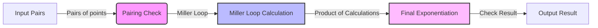

## Module: PairingCheck.java
**模块名称**：PairingCheck.java

**主要目标**：实现对两个扭曲的Barreto–Naehrig曲线上的点进行配对检查操作。配对本身是一种形式为 G1 x G2 -> Gt 的转换，其中 G1 和 G2 分别是 BN128G1 和 BN128G2 的成员，Gt 是 Fp12 字段中单位根的子群，根的度数等于 Params#R。

**关键函数**：
- `create()`：创建 PairingCheck 实例。
- `addPair(BN128G1, BN128G2)`：向序列中添加点对。
- `run()`：在所有对都被添加后执行检查。
- `result()`：获取检查结果，1 表示成功，0 表示失败。
- `millerLoop(BN128G1, BN128G2)`：执行 Miller 循环计算。
- `finalExponentiation(Fp12)`：执行最终指数化计算。

**关键变量**：
- `pairs`：存储点对的列表。
- `product`：Fp12 类型，用于存储配对检查的累积结果。

**相互依赖性**：
- 依赖于 `BN128G1`、`BN128G2` 类的点及其运算。
- 使用 `Fp12` 类进行最终指数化计算。

**核心 vs. 辅助操作**：
- 核心操作包括点对的添加、Miller 循环的执行和最终指数化。
- 辅助操作包括点的仿射坐标转换和预计算的加倍和混合加法。

**操作序列**：
1. 创建 PairingCheck 实例。
2. 逐个添加点对。
3. 执行 `run()` 进行配对检查。
4. 通过 `result()` 获取结果。

**性能方面**：
- 性能考虑主要集中在 Miller 循环和最终指数化的计算效率上。
- 优化点包括点的仿射坐标转换和预计算策略。

**可重用性**：
- 该模块可作为配对基础设施的一部分被重用于其他需要配对检查的应用中。

**使用**：
- 在需要验证两个点是否满足特定配对关系的场合使用，如在某些加密协议中。

**假设**：
- 假设输入的点对是有效的，即属于正确的曲线群。
- 假设调用者了解配对和最终指数化的数学背景。
## Flow Diagram [via mermaid]

