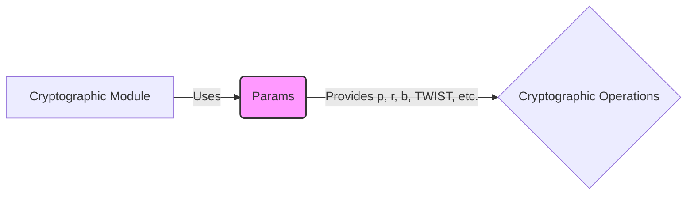

## Module: Params.java
- **模块名称**：Params.java
- **主要目标**：此模块的目的是定义BN曲线及其衍生物和配对所需的共同参数。
- **关键功能**：
  - `P`：定义了F_p, F_p2, F_p6和F_p12的"p"字段参数。
  - `R`：定义了`BN128G2`循环子群的顺序。
  - `B_Fp`：为`BN128Fp`曲线定义了"b"参数。
  - `TWIST`：定义了曲线的扭曲参数。
  - `B_Fp2`：为`BN128Fp2`曲线定义了"b"参数，是`B_Fp`乘以`TWIST`的逆。
  - `TWIST_MUL_BY_P_X`和`TWIST_MUL_BY_P_Y`：定义了扭曲乘以`P`的X和Y坐标参数。
  - `PAIRING_FINAL_EXPONENT_Z`：定义了配对的最终指数`Z`。
- **关键变量**：`P`, `R`, `B_Fp`, `TWIST`, `B_Fp2`, `TWIST_MUL_BY_P_X`, `TWIST_MUL_BY_P_Y`, `PAIRING_FINAL_EXPONENT_Z`。
- **相互依赖性**：此模块主要与实现BN曲线相关的其他加密组件交互。
- **核心与辅助操作**：定义和初始化这些参数是核心操作，因为它们对于BN曲线的加密操作至关重要。没有明显的辅助操作。
- **操作序列**：由于这是一个参数定义模块，没有特定的操作序列。其主要作用是为其他模块提供必要的数学参数。
- **性能方面**：此模块的性能考虑主要关注于参数的正确性和数学运算的效率。由于参数是静态和最终的，不存在性能变化。
- **可重用性**：这些参数具有高度的可重用性，因为它们是设计BN曲线及其相关加密操作的基础。
- **使用**：在需要BN曲线操作（如加密、解密、签名验证等）的地方使用这些参数。
- **假设**：假设使用者对BN曲线及其在密码学中的应用有基本的了解。此外，还假设这些参数已经根据安全标准进行了精心选择和验证。
## Flow Diagram [via mermaid]

