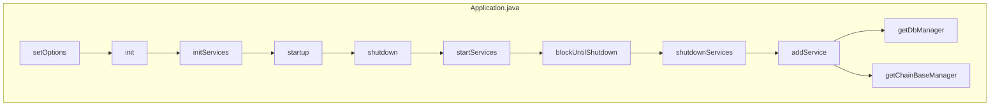

## Module: Application.java
模块名称：Application.java

主要目标：该模块的主要目的是实现应用程序的初始化和管理。

关键功能：主要方法/功能及其作用包括：
- setOptions(Args args)：设置选项参数。
- init(CommonParameter parameter)：初始化应用程序。
- initServices(CommonParameter parameter)：初始化应用程序服务。
- startup()：启动应用程序。
- shutdown()：关闭应用程序。
- startServices()：启动服务。
- blockUntilShutdown()：阻止直到关闭。
- shutdownServices()：关闭服务。
- addService(Service service)：添加服务。
- getDbManager()：获取数据库管理器。
- getChainBaseManager()：获取链基础管理器。

关键变量：重要的变量包括Args、CommonParameter、Service、Manager、ChainBaseManager。

相互依赖性：该模块与其他系统组件的交互主要体现在参数传递和服务调用方面。

核心与辅助操作：核心操作包括初始化、启动和关闭应用程序，辅助操作包括服务管理和参数设置。

操作序列：模块操作的基本顺序为设置参数、初始化、启动、关闭、启动服务、关闭服务。

性能方面：性能考虑主要涉及到初始化和启动过程的效率和资源消耗。

可重用性：该模块具有一定的可重用性，可以根据不同需求适配和重用其中的方法和功能。

用法：该模块用于管理应用程序的初始化和运行过程，通过设置参数、初始化服务等操作来实现应用程序的启动和关闭。

假设：在使用该模块时，假设用户已经了解相关参数和服务配置，并且遵循GNU通用公共许可证的条款。
## Flow Diagram [via mermaid]

