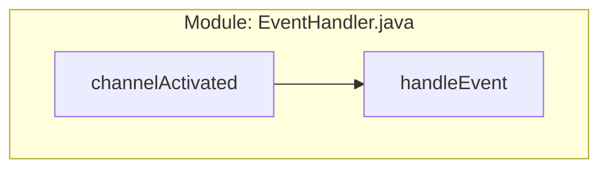

## Module: EventHandler.java
- **模块名称**: EventHandler.java
- **主要目标**: 该模块的目的是定义事件处理程序接口，用于处理激活通道和处理UDP事件。
- **关键函数**: 
   - channelActivated(): 用于激活通道。
   - handleEvent(UdpEvent event): 用于处理UDP事件。
- **关键变量**: 无
- **相互依赖性**: 该模块与其他系统组件的交互主要是接收和处理UDP事件。
- **核心 vs. 辅助操作**: 核心操作是处理UDP事件，辅助操作是激活通道。
- **操作顺序**: 模块首先激活通道，然后处理接收到的UDP事件。
- **性能方面**: 性能方面需要考虑事件处理的效率和准确性。
- **可重用性**: 该模块可以通过实现接口来适应不同的事件处理需求，具有一定的可重用性。
- **用法**: 该模块用于处理激活通道和处理UDP事件，可以被其他模块调用和实现。
- **假设**: 该模块假设接收到的事件是符合UDP协议的。
## Flow Diagram [via mermaid]

