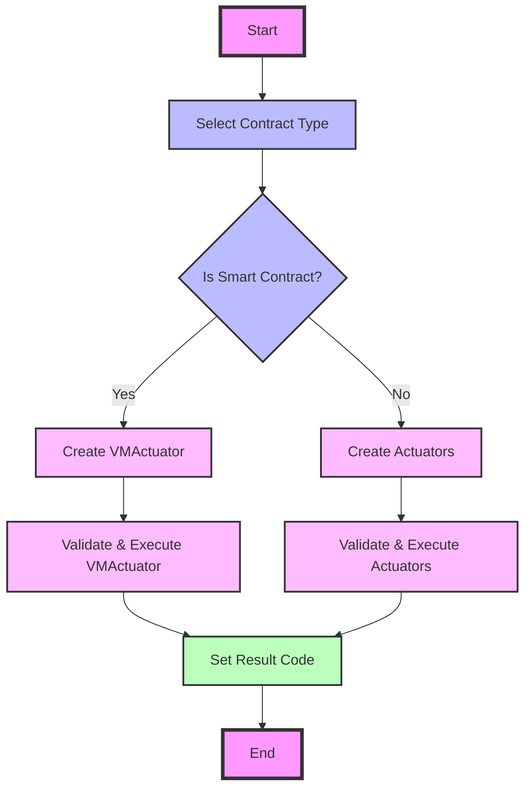

## Module: RuntimeImpl.java
- **模块名称**：RuntimeImpl.java

- **主要目标**：该模块的目的是执行智能合约的验证和执行流程，处理与智能合约执行相关的异常，并返回执行结果。

- **关键功能**：
  - `execute`：根据交易上下文执行智能合约，处理不同类型的合约执行或验证。
  - `getResult`：返回智能合约执行的结果。
  - `getRuntimeError`：获取执行过程中的运行时错误。
  - `setResultCode`：根据程序执行结果和异常设置结果代码。

- **关键变量**：
  - `context`：TransactionContext对象，包含执行智能合约所需的所有上下文信息。
  - `actuatorList`：Actuator列表，用于普通合约的执行。
  - `actuator2`：用于特定类型合约（如VMActuator）的执行。

- **相互依赖性**：与`TransactionContext`、`Actuator`、`ProgramResult`等其他系统组件交互，以获取执行上下文、执行合约以及返回执行结果。

- **核心与辅助操作**：
  - 核心操作：智能合约的验证和执行。
  - 辅助操作：异常处理和结果代码设置。

- **操作序列**：首先根据合约类型初始化执行器，然后进行合约验证，接着执行合约，并最终设置结果代码。

- **性能方面**：性能考虑可能包括合约执行的效率、异常处理的速度和结果代码设置的准确性。

- **可重用性**：此模块设计用于执行各种智能合约，具有较高的可重用性，可以适应不同类型的合约执行需求。

- **使用**：在智能合约的执行流程中被调用，用于处理合约的验证、执行以及异常处理。

- **假设**：假设所有传入的交易上下文和合约都是有效的，且系统中已经定义了所有必要的执行器和异常处理机制。
## Flow Diagram [via mermaid]

