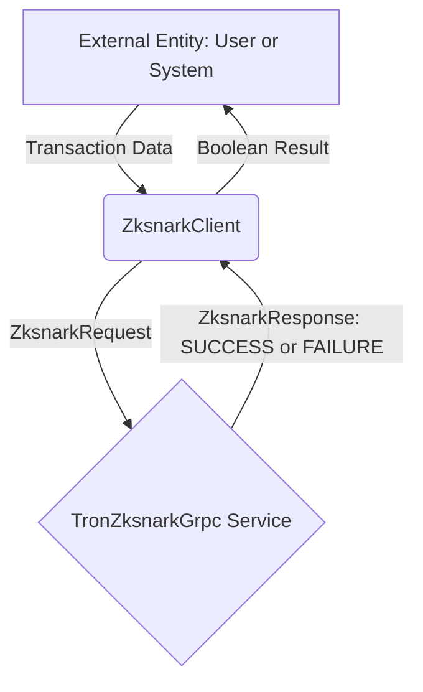

## Module: ZksnarkClient.java
- **模块名称**: ZksnarkClient.java

- **主要目标**: 此模块的目的是为了提供一个接口，通过这个接口可以与Tron区块链上的Zksnark（零知识证明）服务进行通信，主要用于检查Zksnark证明的有效性。

- **关键功能**:
  - `getInstance()`: 获取ZksnarkClient的实例。
  - `checkZksnarkProof(Transaction transaction, byte[] sighash, long valueBalance)`: 检查给定的Zksnark证明是否有效。它需要交易信息、签名哈希和价值平衡作为参数。

- **关键变量**:
  - `instance`: ZksnarkClient的单例实例。
  - `blockingStub`: 用于与gRPC服务进行通信的阻塞存根。

- **相互依赖性**: 此模块依赖于`TronZksnarkGrpc`类来创建与Zksnark服务的gRPC连接，并且还依赖于`TransactionCapsule`和`Transaction`类来处理交易数据。

- **核心与辅助操作**:
  - 核心操作: `checkZksnarkProof`方法是此模块的核心功能，用于验证Zksnark证明的有效性。
  - 辅助操作: `getInstance`方法用于提供模块的单例实例。

- **操作序列**: 用户首先通过`getInstance`方法获取ZksnarkClient的实例，然后可以使用`checkZksnarkProof`方法来检查特定交易的Zksnark证明。

- **性能方面**: 在性能考虑方面，与gRPC服务的通信可能会影响到方法的响应时间，尤其是在网络状况不佳的情况下。

- **可重用性**: 此模块设计为单例模式，易于在不同的上下文中重用，同时提供了一个明确的接口与Zksnark服务进行交互。

- **使用方式**: 开发者可以通过调用`ZksnarkClient.getInstance().checkZksnarkProof(transaction, sighash, valueBalance)`来验证交易的Zksnark证明。

- **假设**: 
  - 假设gRPC服务运行在"127.0.0.1:60051"。
  - 假设所有传入的参数（交易信息、签名哈希和价值平衡）都是有效和正确格式的。
  - 假设Tron区块链的Zksnark服务可用且响应时间合理。
## Flow Diagram [via mermaid]

