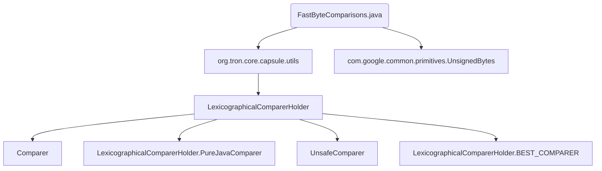

## Module: FastByteComparisons.java
模块名称：FastByteComparisons.java

主要目标：该模块的目的是提供优化的字节数组比较功能，允许比较从非零偏移开始的数组。

关键功能：equalByte方法用于比较两个字节数组是否相等；compareTo方法用于按字典顺序比较两个字节数组。

关键变量：b1, b2（字节数组）；s1, s2（偏移量）；l1, l2（长度）

相互依赖性：该模块依赖LexicographicalComparerHolder类中的BEST_COMPARER来执行比较操作。

核心与辅助操作：equalByte和compareTo是核心操作，LexicographicalComparerHolder和PureJavaComparer是辅助操作。

操作顺序：首先调用equalByte方法判断两个字节数组是否相等，然后调用compareTo方法按字典顺序比较两个字节数组。

性能方面：该模块使用了优化的比较算法，可以提高比较效率。

可重用性：该模块提供了通用的字节数组比较功能，可在不同项目中重复使用。

用法：通过调用equalByte和compareTo方法，可以在程序中进行字节数组的比较操作。

假设：该模块假设字节数组的长度和偏移量都是有效的。
## Flow Diagram [via mermaid]

