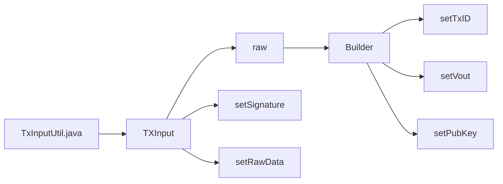

## Module: TxInputUtil.java
- **模块名称**: TxInputUtil.java
- **主要目标**: 该模块的目的是创建新的交易输入。
- **关键功能**: 
   - newTxInput方法：创建新的交易输入并返回TXInput对象。
- **关键变量**: 
   - txId: 交易ID
   - vout: 交易输出
   - signature: 签名
   - pubKey: 公钥
- **相互依赖**: 该模块依赖于com.google.protobuf.ByteString和org.tron.protos.Protocol.TXInput。
- **核心 vs. 辅助操作**: 
   - 核心操作为创建新的交易输入。
- **操作序列**: 
   - 调用newTxInput方法来创建新的交易输入。
- **性能方面**: 
   - 需要考虑创建新的交易输入的性能。
- **可重用性**: 
   - 该模块可以被重复使用来创建不同的交易输入。
- **用法**: 
   - 可以通过调用newTxInput方法来创建新的交易输入。
- **假设**: 
   - 假设传入的参数符合要求，如txId为byte数组，vout为整数，signature和pubKey为byte数组。
## Flow Diagram [via mermaid]

