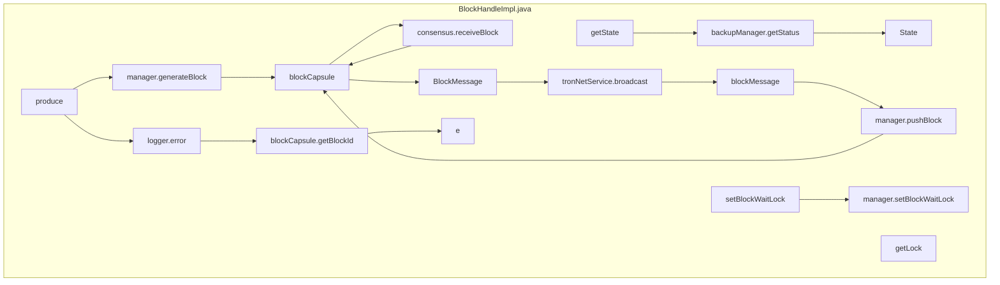

## Module: BlockHandleImpl.java
模块名称：BlockHandleImpl.java

主要目标：该模块的主要目的是处理区块相关的操作，包括生成区块、处理区块消息等。

关键功能：主要方法/函数包括getState()、getLock()、produce()、setBlockWaitLock()，分别用于获取状态、获取锁、生成区块、设置区块等待锁。

关键变量：关键变量包括manager、backupManager、tronNetService、consensus等，用于管理区块、备份、网络服务和共识相关操作。

相互依赖性：该模块与Manager、BackupManager、TronNetService、Consensus等组件有相互依赖关系，通过注入实现交互。

核心与辅助操作：核心操作包括生成区块、处理区块消息等；辅助操作包括获取状态、获取锁等。

操作序列：操作序列包括获取状态、生成区块、处理区块消息、广播区块等一系列操作流程。

性能方面：考虑到生成区块、处理区块消息等操作可能影响性能，需要进行性能优化。

可重用性：该模块具有一定的可重用性，可以在其他区块链项目中进行适配和重用。

用法：该模块用于处理区块相关操作，包括生成区块、处理区块消息等，可以通过调用相应方法实现功能。

假设：假设备份状态为主节点时，返回状态为OK；假设生成区块失败时，返回null。
## Flow Diagram [via mermaid]

