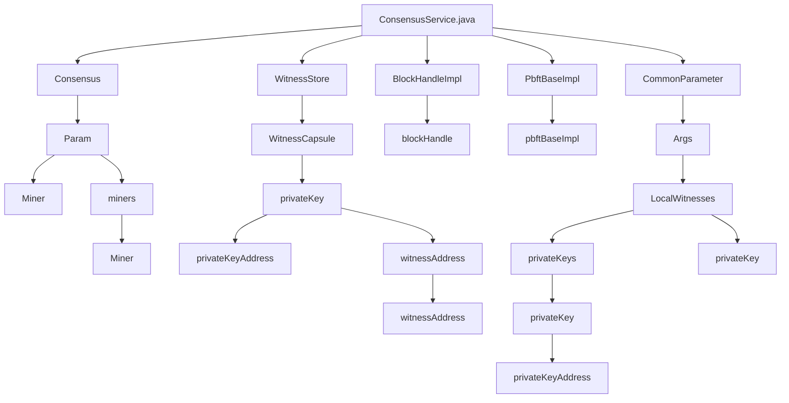

## Module: ConsensusService.java
模块：ConsensusService.java

主要目标：该模块的主要目标是实现共识服务的功能。

关键功能：主要方法/函数及其作用包括：
- start()：启动共识服务，设置参数并启动共识。
- stop()：停止共识服务。

关键变量：重要变量包括Param、Miner、miners等。

相互依赖：与其他系统组件的交互包括Consensus、WitnessStore、BlockHandleImpl、PbftBaseImpl等。

核心与辅助操作：核心操作为启动和停止共识服务，辅助操作包括设置参数和处理见证者信息。

操作序列：操作序列包括设置参数、处理私钥、添加见证者、启动共识服务等步骤。

性能方面：性能考虑包括共识服务的启动速度和稳定性。

可重用性：该模块可根据需要适应不同的共识算法和见证者配置。

用法：该模块用于启动和停止共识服务，并处理见证者信息。

假设：假设模块中的参数和见证者信息已经正确配置。
## Flow Diagram [via mermaid]

