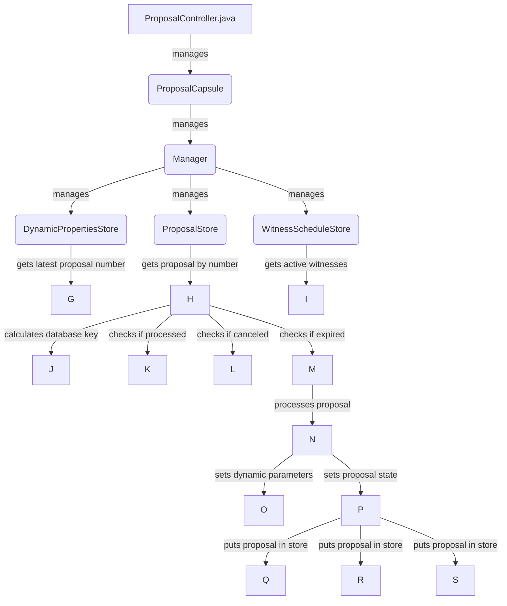

## Module: ProposalController.java
模块：ProposalController.java

主要目标：该模块的主要目的是处理提案，并根据一定的规则对提案进行处理和更新状态。

关键功能：主要方法包括processProposals（处理提案）、processProposal（处理单个提案）、setDynamicParameters（设置动态参数）。

关键变量：主要变量包括latestProposalNum（最新提案编号）、proposalCapsule（提案胶囊）、activeWitnesses（活跃见证人）等。

相互依赖：该模块与Manager和其他系统组件之间存在相互依赖关系，通过Manager来获取数据和执行操作。

核心与辅助操作：主要操作为处理提案和设置动态参数，辅助操作包括日志记录和异常处理等。

操作序列：首先获取最新提案编号，然后依次处理每个提案，根据一定条件更新提案状态。

性能方面：性能考虑主要集中在处理大量提案时的效率和资源利用。

可重用性：该模块具有一定的可重用性，可以根据需要进行适当修改和重用。

用法：ProposalController模块用于处理区块链提案的逻辑，通过调用不同方法实现提案的处理和状态更新。

假设：假设提案数据存储和处理过程中不会出现严重错误，提案状态更新符合规则。
## Flow Diagram [via mermaid]

