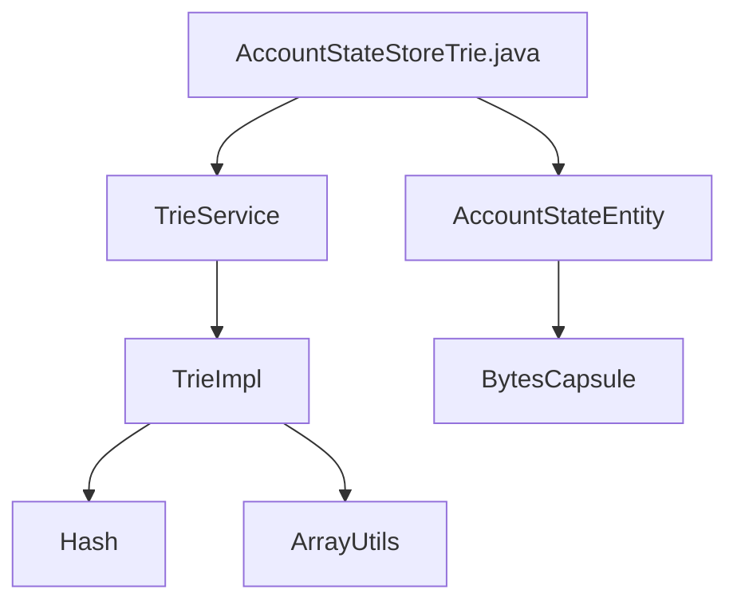

## Module: AccountStateStoreTrie.java
- **模块名称**: AccountStateStoreTrie.java
- **主要目标**: 此模块的目的是管理账户状态的存储和检索。
- **关键功能**: 
   - `getAccount(byte[] key)`: 根据给定的键获取账户状态。
   - `getAccount(byte[] key, byte[] rootHash)`: 根据给定的键和根哈希值获取账户状态。
   - `getSolidityAccount(byte[] key)`: 获取Solidity账户的状态。
   - `isEmpty()`: 检查存储是否为空。
   - `remove(byte[] bytes)`: 删除指定的字节数组。
   - `get(byte[] key)`: 获取指定键的字节胶囊。
   - `put(byte[] key, BytesCapsule item)`: 存储指定键和字节胶囊。
- **关键变量**: 
   - `trieService`: Trie服务。
   - `dbName`: 数据库名称。
- **相互依赖**: 与`TrieService`和其他数据库组件进行交互。
- **核心 vs. 辅助操作**: 核心操作是获取和存储账户状态，而辅助操作包括删除和统计。
- **操作序列**: 初始化Trie服务，设置根哈希值，获取账户状态。
- **性能方面**: 考虑了数据库大小和检索速度。
- **可重用性**: 可以适应不同的账户状态存储和检索需求。
- **用途**: 用于管理和检索账户状态信息。
- **假设**: 假设包括数据库结构和存储模式的一致性。
## Flow Diagram [via mermaid]

