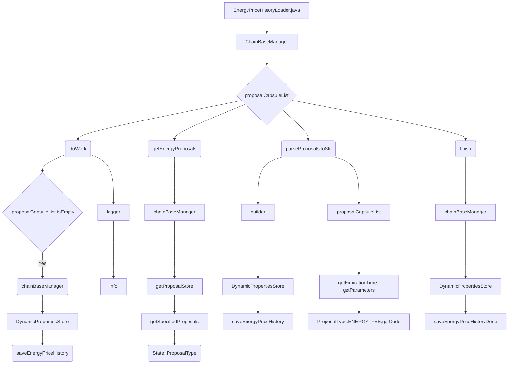

## Module: EnergyPriceHistoryLoader.java
- **模块名称**: EnergyPriceHistoryLoader.java
- **主要目标**: 该模块的目的是加载能源价格历史数据并保存到数据库中。
- **关键功能**: 
   - doWork(): 执行加载能源价格历史数据的主要方法，调用其他方法完成加载和保存操作。
   - getEnergyProposals(): 获取已批准的能源费用提案列表。
   - parseProposalsToStr(): 将提案转换为字符串形式。
   - finish(): 完成加载并保存能源价格历史数据的操作。
- **关键变量**: 
   - chainBaseManager: ChainBaseManager对象，用于管理区块链数据。
   - proposalCapsuleList: 保存提案对象的列表。
- **相互依赖**: 与ChainBaseManager、ProposalCapsule等组件交互以获取和保存数据。
- **核心 vs. 辅助操作**: 主要操作包括加载、保存能源价格历史数据；辅助操作包括转换提案为字符串等。
- **操作顺序**: 
   1. 调用doWork()方法开始加载能源价格历史数据。
   2. 调用getEnergyProposals()获取能源费用提案列表。
   3. 调用parseProposalsToStr()将提案转换为字符串。
   4. 调用finish()完成加载和保存操作。
- **性能方面**: 执行加载和保存操作可能会影响系统性能，需考虑优化。
- **可重用性**: 该模块可以根据需要适应不同的数据加载和保存操作。
- **用法**: 通过创建EnergyPriceHistoryLoader对象并调用doWork()方法来加载和保存能源价格历史数据。
- **假设**: 假设ChainBaseManager和ProposalCapsule对象已正确初始化。
## Flow Diagram [via mermaid]

