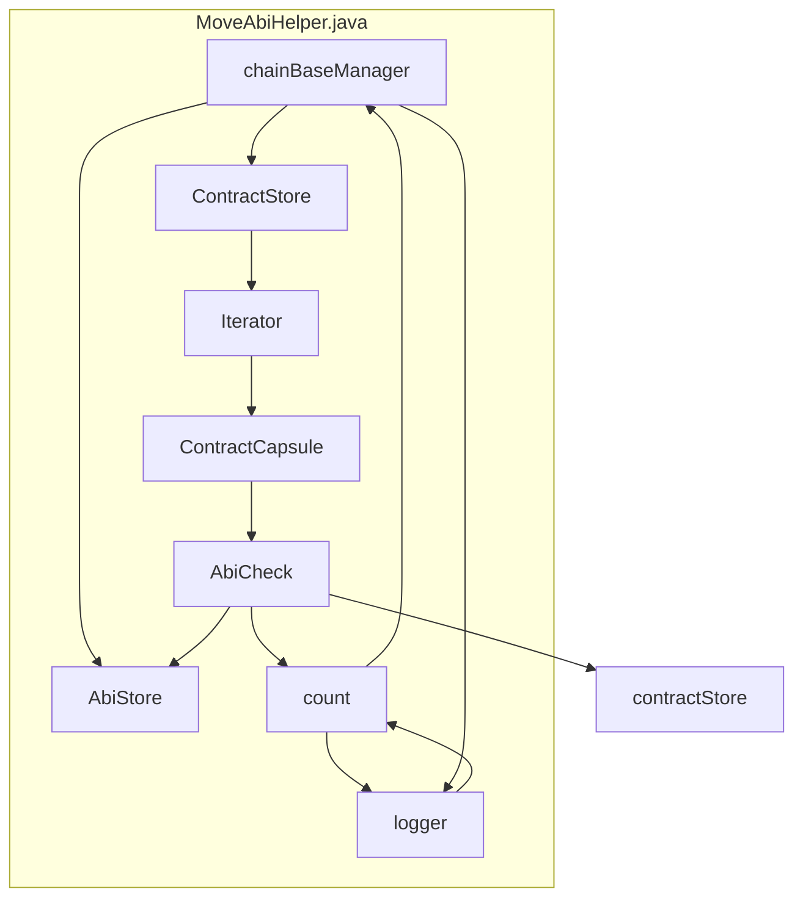

## Module: MoveAbiHelper.java
模块名: MoveAbiHelper.java

主要目标: 该模块的目的是将合约的ABI信息从一个存储位置移动到另一个存储位置。

关键功能: 
1. doWork()方法: 执行ABI信息的移动操作，遍历合约存储，将非空ABI信息存储到新位置，并更新计数。
2. 构造函数MoveAbiHelper(): 初始化ChainBaseManager对象。

关键变量: 
1. count: 计数移动的ABI信息数量。
2. chainBaseManager: ChainBaseManager对象，用于访问ABI和合约存储。

相互依赖: 该模块与ChainBaseManager、AbiStore、ContractStore等系统组件进行交互，通过这些组件访问和操作合约的ABI信息。

核心操作与辅助操作: 
- 核心操作是doWork()方法中的ABI信息移动和更新操作。
- 辅助操作包括日志记录和计数更新。

操作顺序: 
1. 初始化计时器和日志记录。
2. 遍历合约存储，将非空ABI信息移动到新位置。
3. 更新计数和日志记录移动进度。
4. 保存ABI移动完成状态和记录总体时间和数量。

性能考虑: 
- 遍历大量合约数据时，性能可能受到影响。
- 每移动一定数量的ABI信息时，记录日志会增加系统开销。

可重用性: 
- 该模块可以适用于不同的合约存储迁移场景，可根据需要进行调整和重用。

用法: 
- 实例化MoveAbiHelper对象，并传入ChainBaseManager对象。
- 调用doWork()方法执行ABI信息的移动操作。

假设: 
- 假设合约存储中的合约Capsule包含ABI信息。
- 假设ABI信息存储在AbiStore中。
## Flow Diagram [via mermaid]

