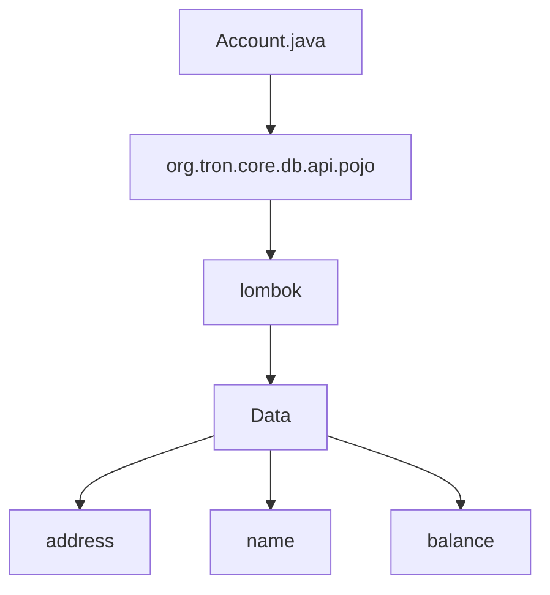

## Module: Account.java
- **模块名称**: Account.java
- **主要目标**: 定义其目的是存储账户信息。
- **关键功能**: 列出主要方法/功能及其作用。包括构造函数of，获取账户地址，获取账户名称，获取账户余额。
- **关键变量**: 指出必要的变量。包括地址(address)、名称(name)、余额(balance)。
- **相互依赖性**: 注意与其他系统组件的交互。这个模块可能依赖于数据库或其他数据存储组件。
- **核心与辅助操作**: 区分主要操作和辅助操作。主要操作包括获取账户信息，辅助操作可能包括更新账户信息。
- **操作顺序**: 描述任何明显的流程。可能包括创建账户对象，设置账户信息，存储账户信息。
- **性能方面**: 提及性能考虑。可能需要考虑数据库读写性能、数据存储效率等。
- **可重用性**: 谈论适用于重用的灵活性。该模块可以轻松地用于不同的项目中存储账户信息。
- **使用**: 讨论如何使用。可以通过创建Account对象并设置相应信息来使用此模块。
- **假设**: 列出任何假设。假设该模块的目的是简单地存储账户信息而不涉及复杂的业务逻辑。
## Flow Diagram [via mermaid]

