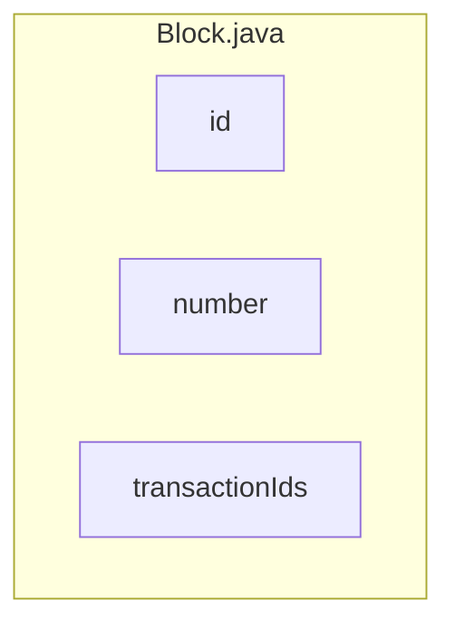

## Module: Block.java
- **模块名称**: Block.java

- **主要目标**: 此模块的目的是定义一个名为Block的类，用于表示区块链中的区块。

- **关键功能**: 
   1. getId(): 返回区块的ID。
   2. getNumber(): 返回区块的编号。
   3. getTransactionIds(): 返回区块中的交易ID列表。

- **关键变量**: 
   1. id: 用于存储区块的唯一标识符。
   2. number: 用于存储区块的编号。
   3. transactionIds: 用于存储区块中的交易ID列表。

- **相互依赖**: 该模块可能与其他系统组件（如交易类）相互交互，以提供完整的区块链功能。

- **核心 vs. 辅助操作**: 核心操作包括获取区块ID、编号和交易ID列表，辅助操作可能包括其他与区块相关的功能。

- **操作顺序**: 模块的操作顺序可能包括创建区块实例、设置ID、编号和交易ID列表。

- **性能方面**: 该模块的性能可能受到数据存取速度和内存占用的影响。

- **可重用性**: 该模块可以轻松地在其他区块链项目中重用，只需根据需要调整变量和方法。

- **用法**: Block类可以在区块链应用程序中用于表示和操作区块，以便在系统中跟踪交易和区块链状态。

- **假设**: 假设该模块与其他区块链组件（如交易和区块链）协同工作，以提供完整的区块链功能。
## Flow Diagram [via mermaid]

