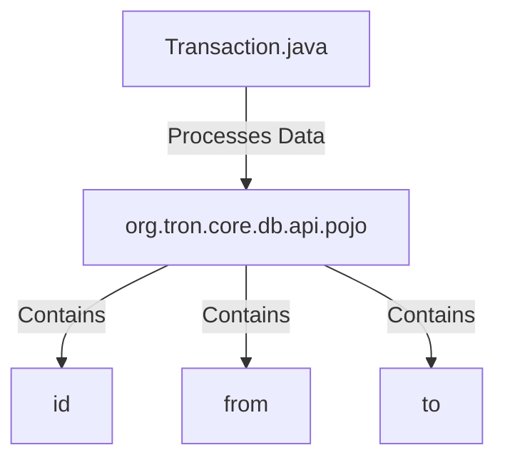

## Module: Transaction.java
模块名称：Transaction.java

主要目标：该模块的主要目标是定义和表示交易。

关键功能：主要方法/功能及其作用：
1. getId()：返回交易的ID。
2. getFrom()：返回交易发起方。
3. getTo()：返回交易接收方。

关键变量：重要变量包括：
1. id：交易的ID。
2. from：交易发起方。
3. to：交易接收方。

相互依赖性：与其他系统组件的交互：
Transaction模块可能与数据库或其他数据存储模块进行交互，以检索或存储交易信息。

核心与辅助操作：区分主要操作和辅助操作：
主要操作包括获取交易ID、发起方和接收方信息。辅助操作可能包括验证交易信息的完整性或有效性。

操作序列：描述任何特定的流程：
1. 创建Transaction对象。
2. 设置交易的ID、发起方和接收方。
3. 执行相应的交易操作。

性能方面：性能考虑：
Transaction模块的性能取决于数据存储和访问的效率，以及交易信息的处理速度。

可重用性：适用于重用性的讨论：
Transaction模块可以轻松地在不同的应用程序中重复使用，以表示和处理交易信息。

用法：讨论如何使用：
1. 在应用程序中导入Transaction模块。
2. 创建Transaction对象并设置相关信息。
3. 使用Transaction对象执行交易操作。

假设：列出任何假设：
假设Transaction模块与其他模块协同工作，以确保交易信息的正确性和一致性。
## Flow Diagram [via mermaid]


This diagram illustrates the flow of data within the Transaction.java module and its related components.
```
