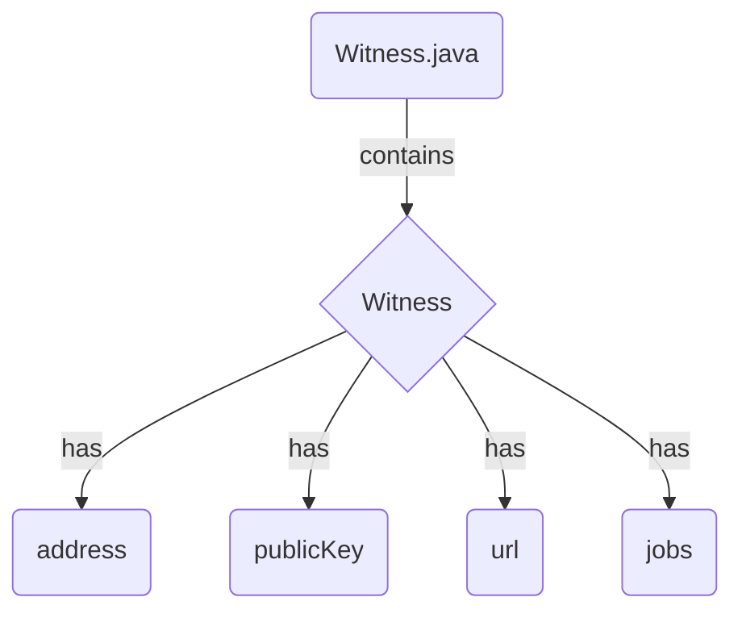

## Module: Witness.java
- **模块名称**: Witness.java
- **主要目标**: 这个模块的目的是定义和表示见证人信息。
- **关键功能**: 
   - `getAddress()`: 返回地址信息。
   - `getPublicKey()`: 返回公钥信息。
   - `getUrl()`: 返回URL信息。
   - `isJobs()`: 返回工作状态。
- **关键变量**: 
   - `address`: 保存地址信息。
   - `publicKey`: 保存公钥信息。
   - `url`: 保存URL信息。
   - `jobs`: 保存工作状态。
- **相互依赖性**: 该模块可能与其他系统组件进行交互，如数据库操作或网络通信。
- **核心操作 vs. 辅助操作**: 核心操作包括获取地址、公钥、URL和工作状态信息，而辅助操作可能包括验证和处理数据。
- **操作序列**: 模块可能按照获取信息、处理信息、更新状态的顺序执行。
- **性能方面**: 考虑到数据量和处理速度对模块性能的影响。
- **重复使用性**: 该模块可以在不同系统中重复使用，只需提供不同的见证人信息。
- **用法**: 可以通过创建Witness对象并设置相应信息来使用该模块。
- **假设**: 假设模块的输入数据是有效的，并且对地址、公钥、URL和工作状态有一定了解。
## Flow Diagram [via mermaid]

