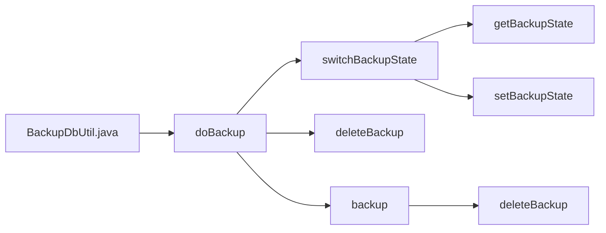

## Module: BackupDbUtil.java
模块：BackupDbUtil.java

主要目标：此模块的目的是备份数据库。

关键功能：包括获取备份状态、设置备份状态、切换备份状态、执行备份、备份和删除备份等方法。

关键变量：DB_BACKUP_STATE、DB_BACKUP_INDEX1、DB_BACKUP_INDEX2、DB_BACKUP_STATE_DEFAULT。

相互依赖：与RevokingDatabase、Chainbase、SnapshotManager等组件有交互。

核心与辅助操作：核心操作包括备份和删除备份，辅助操作包括获取和设置备份状态。

操作序列：执行备份操作时，根据当前备份状态执行相应的备份和删除备份操作。

性能方面：备份操作可能会对系统性能产生影响，需要考虑备份过程所需的时间。

可重用性：该模块具有一定的可重用性，可以通过调用相关方法进行数据库备份操作。

用法：通过调用doBackup方法执行数据库备份操作。

假设：假设备份状态的值在一定范围内，如果prop文件是新创建的，则返回默认状态。
## Flow Diagram [via mermaid]

