## Module: TronNetDelegate.java
模块名称：TronNetDelegate.java

主要目标：该模块的主要目标是处理和管理与Tron网络相关的功能和操作。

关键功能：主要方法/功能及其作用包括：
- init(): 初始化方法，启动一个线程以监视网络状态。
- close(): 关闭方法，用于关闭线程并释放资源。
- getActivePeer(): 获取当前活动的对等节点。
- getSyncBeginNumber(): 获取同步开始的区块号。
- processBlock(BlockCapsule block, boolean isSync): 处理区块的方法，包括验证、存储和处理异常情况。
- pushTransaction(TransactionCapsule trx): 推送交易到数据库中。
- validSignature(BlockCapsule block): 验证区块的签名。
- validBlock(BlockCapsule block): 验证区块的有效性。

关键变量：重要变量包括blockLock、backupServer、metricsService等。

相互依赖性：与其他系统组件的交互包括与数据库管理器、区块链基础管理器等的交互。

核心与辅助操作：核心操作包括处理区块、验证签名等，辅助操作包括初始化、关闭等。

操作序列：操作序列包括初始化、处理区块、推送交易等步骤。

性能方面：性能方面考虑了对于大量交易和区块的处理效率。

可重用性：该模块具有一定的可重用性，可以用于处理不同的Tron网络操作。

用途：用于处理Tron网络中的区块、交易、签名验证等操作。

假设：假设数据库管理器、区块链基础管理器等组件正常运行。
## Flow Diagram [via mermaid]

```mermaid
flowchart
    subgraph TronNetDelegate.java
        dbManager
        chainBaseManager
        witnessScheduleStore
        blockLock
        backupServer
        metricsService
        backupServerStartFlag
        blockIdCacheSize
        timeout
        hitDown
        hitThread
        exit
        maxUnsolidifiedBlocks
        unsolidifiedBlockCheck
        freshBlockId
        init
        close
        getActivePeer
        getSyncBeginNumber
        getBlockTime
        getHeadBlockId
        getKhaosDbHeadBlockId
        getSolidBlockId
        getGenesisBlockId
        getBlockIdByNum
        getGenesisBlock
        getHeadBlockTimeStamp
        containBlock
        containBlockInMainChain
        getBlockChainHashesOnFork
        canChainRevoke
        contain
        getData
        processBlock
        pushTransaction
        validSignature
        validBlock
        getBlockPbftCommitData
        getSRLPbftCommitData
        allowPBFT
        getForkLock
        getNextMaintenanceTime
        getMaintenanceTimeInterval
        isBlockUnsolidified
    end
```

