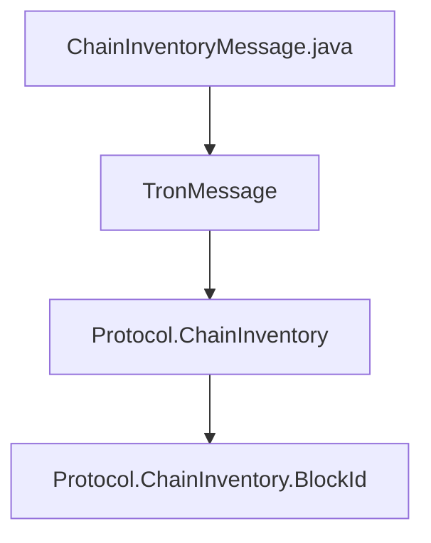

## Module: ChainInventoryMessage.java
模块名称: ChainInventoryMessage.java

主要目标: 该模块的目的是处理区块链库存消息，包括解析和构建区块链库存消息。

关键功能: 
1. ChainInventoryMessage(byte[] data): 解析接收到的字节数组数据，并将其转换为ChainInventory消息对象。
2. ChainInventoryMessage(List<BlockId> blockIds, Long remainNum): 构建包含区块ID列表和剩余数量的ChainInventory消息对象。
3. getBlockIds(): 获取ChainInventory消息中的区块ID列表。
4. getRemainNum(): 获取ChainInventory消息中的剩余数量。
5. toString(): 将ChainInventory消息转换为字符串表示形式。

关键变量: 
- chainInventory: 保存ChainInventory消息对象。
- data: 存储ChainInventory消息的字节数组数据。

相互依赖性: 该模块与其他系统组件的交互包括解析和构建区块链库存消息。

核心与辅助操作: 核心操作包括解析和构建区块链库存消息，辅助操作包括获取区块ID列表和剩余数量。

操作序列: 模块首先解析接收到的字节数组数据或构建包含区块ID列表和剩余数量的ChainInventory消息对象，然后提供方法获取区块ID列表和剩余数量，并将消息转换为字符串表示形式。

性能方面: 考虑到数据解析和转换的性能影响。

可重用性: 该模块可以通过调整输入数据来适应不同的区块链库存消息。

用法: 该模块用于处理接收到的区块链库存消息，并提供方法获取其中的区块ID列表和剩余数量。

假设: 假设输入数据符合ChainInventory消息的格式。
## Flow Diagram [via mermaid]

