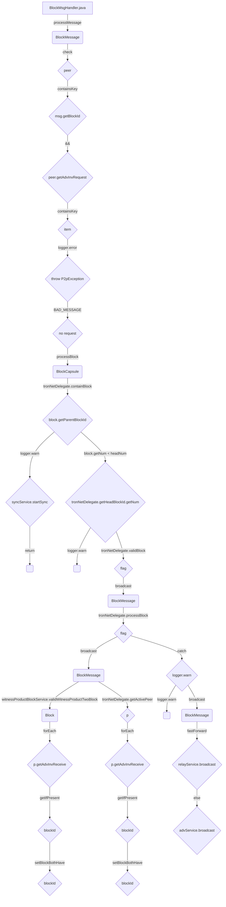

## Module: BlockMsgHandler.java
模块：BlockMsgHandler.java

主要目标：处理区块消息的相关功能。

关键功能：包括处理消息、检查区块、处理区块等方法。

关键变量：maxBlockSize、fastForward、blockMessage等。

相互依赖：与RelayService、TronNetDelegate、AdvService、SyncService、FetchBlockService等组件有交互。

核心操作 vs. 辅助操作：核心操作包括处理消息、处理区块；辅助操作包括检查区块。

操作序列：接收区块消息，检查区块，处理区块，广播消息。

性能方面：考虑区块大小、时间延迟等性能因素。

可重用性：可以适应不同场景下的区块处理需求。

用途：用于处理区块消息传输和验证。

假设：假设区块大小不超过限制，时间间隔合理等。
## Flow Diagram [via mermaid]

