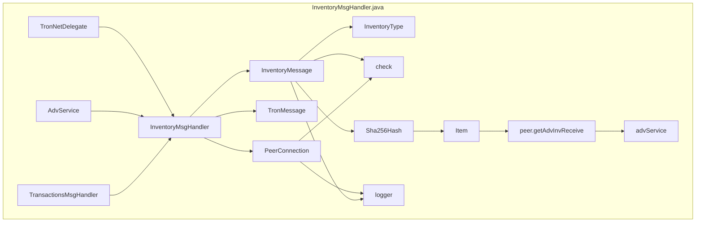

## Module: InventoryMsgHandler.java
模块名称: InventoryMsgHandler.java

主要目标: 该模块的主要目的是处理库存消息，包括验证和处理接收到的库存消息。

关键功能: 
- processMessage(PeerConnection peer, TronMessage msg): 处理接收到的库存消息，将消息中的哈希列表和类型添加到对等节点的库存接收列表和广告服务中。
- check(PeerConnection peer, InventoryMessage inventoryMessage): 验证接收到的库存消息是否符合条件，包括检查对等节点是否需要从其他节点同步，区块是否未稳定，交易处理程序是否繁忙等。

关键变量: 
- inventoryMessage: 库存消息对象，包含库存类型和哈希列表。
- type: 库存类型，表示消息中的数据类型。
- item: 用于表示库存消息中的单个项目。

相互依赖: 
- 与TronNetDelegate、AdvService和TransactionsMsgHandler等组件相互依赖，需要这些组件的支持来处理和验证库存消息。

核心操作 vs. 辅助操作: 
- 核心操作是处理和验证接收到的库存消息，辅助操作可能包括日志记录和条件检查。

操作序列: 
- 接收库存消息 -> 验证消息 -> 处理消息 -> 更新库存接收列表和广告服务。

性能方面: 
- 库存消息处理的性能取决于库存消息的数量和对等节点的处理能力。

可重用性: 
- 该模块可以根据需要适应不同的库存消息处理场景，具有一定的可重用性。

用法: 
- 该模块用于接收、验证和处理网络中传递的库存消息，以确保节点之间的数据同步和交换。

假设: 
- 假设该模块在处理库存消息时需要依赖其他系统组件的支持，如TronNetDelegate、AdvService和TransactionsMsgHandler。
## Flow Diagram [via mermaid]

