## Module: PbftDataSyncHandler.java
模块名称: PbftDataSyncHandler.java

主要目标: 该模块的目的是处理PBFT数据同步相关的消息。

关键功能: 
1. processMessage(PeerConnection peer, TronMessage msg): 处理接收到的消息，将PBFT提交消息存储到缓存中。
2. processPBFTCommitData(BlockCapsule block): 处理PBFT提交数据，根据区块号获取相应的PBFT提交消息进行处理。
3. processPBFTCommitMessage(PbftCommitMessage pbftCommitMessage): 处理具体的PBFT提交消息，验证签名并将数据存储到PbftSignDataStore中。
4. validPbftSign(Raw raw, List<ByteString> srSignList, List<ByteString> currentSrList): 验证PBFT签名的有效性。

关键变量: 
1. pbftCommitMessageCache: 存储PBFT提交消息的缓存。
2. executorService: 执行线程池。
3. chainBaseManager: 区块链基础管理器。

相互依赖: 该模块与区块链基础管理器、PBFT签名数据存储等组件相互交互。

核心与辅助操作: 核心操作包括处理PBFT提交消息和验证签名，辅助操作包括线程池管理和异常处理。

操作序列: 
1. 接收消息并存储到缓存中。
2. 处理PBFT提交数据，验证签名并存储到PbftSignDataStore中。

性能方面: 考虑到线程池的使用和数据存储的效率。

可重用性: 该模块具有良好的可重用性，可用于处理不同区块链网络中的PBFT数据同步。

用途: 用于处理PBFT数据同步相关的消息，确保数据的一致性和完整性。

假设: 假设PBFT提交消息的数据格式符合预期，签名正确且有效。
## Flow Diagram [via mermaid]

```mermaid
graph TD
    A[PbftDataSyncHandler.java] -->|processMessage| B(TronMessage)
    B -->|getPBFTCommitResult| C{Raw}
    C -->|parseFrom| D{pbftCommitMessageCache}
    D -->|put| E(pbftCommitMessage)
    E -->|processPBFTCommitMessage| F{Raw}
    F -->|parseFrom| G{epoch}
    G -->|getEpoch| H(pbftCommitMessage)
    H -->|processPBFTCommitMessage| I{Raw}
    I -->|parseFrom| J{epoch}
    J -->|remove| K(pbftCommitMessage)
    K -->|processPBFTCommitMessage| L{Raw}
    L -->|parseFrom| M{validPbftSign}
    M -->|getBlockSignData| N{pbftSignDataStore}
    N -->|putBlockSignData| O(pbftCommitMessage)
    O -->|info| P{validPbftSign}
    P -->|hash| Q{dataHash}
    Q -->|add| R{srSignSet}
    R -->|size| S{AgreeNodeCount}
    S -->|compare| T{srSet}
    T -->|submit| U{ValidPbftSignTask}
    U -->|call| V{signatureToAddress}
    V -->|contains| W{srSet}
    W -->|remove| X{srSignSet}
    X -->|return| Y{true/false}
    Y -->|info| Z{valid sr signature fail}
    Z -->|error| AA{logger}
    AA -->|return| BB{false}
    BB -->|error| CC{valid sr list sign fail}
    CC -->|return| DD{false}
    DD -->|return| EE{true}
    EE -->|info| FF{Save the block/srl}
    FF -->|putBlockSignData/putSrSignData| GG{pbftSignDataStore}
    GG -->|info| HH{Save the block/srl}
    HH -->|error| II{logger}
    II -->|return| JJ{false}
    JJ -->|error| KK{logger}
    KK -->|error| LL{logger}
    LL -->|return| MM{false}
    MM -->|return| NN{true}
    NN -->|info| OO{Save the block/srl}
    OO -->|putBlockSignData/putSrSignData| PP{pbftSignDataStore}
    PP -->|error| QQ{logger}
    QQ -->|return| RR{false}
    RR -->|error| SS{logger}
    SS -->|return| TT{false}
    TT -->|return| UU{true}
```

