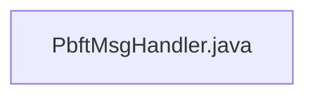

## Module: PbftMsgHandler.java
模块名称：PbftMsgHandler.java

主要目标：此模块的主要目标是处理PBFT消息，并进行验证、转发和执行相关操作。

关键功能：主要方法/功能及其作用包括：
- processMessage(PeerConnection peer, PbftMessage msg): 处理接收到的PBFT消息，验证签名，检查消息类型和时效性，并执行相应操作。
- forwardMessage(PeerConnection peer, PbftBaseMessage message): 转发消息给其他对等节点。

关键变量：关键变量包括：
- striped: 用于管理锁的Striped对象。
- msgCache: 用于缓存消息的Cache对象。
- pbftManager: 用于管理PBFT共识的PbftManager对象。
- tronNetDelegate: 用于处理网络连接的TronNetDelegate对象。

相互依赖：该模块与其他系统组件的交互包括与PBFT共识管理器（PbftManager）、网络连接代理（TronNetDelegate）和对等节点（PeerConnection）的交互。

核心与辅助操作：核心操作包括处理和转发消息，辅助操作包括构建缓存键和分析签名。

操作顺序：处理消息的操作顺序包括验证消息、检查时效性、执行操作、转发消息。

性能方面：性能考虑主要包括缓存容量、锁管理和消息处理效率。

可重用性：该模块具有较高的可重用性，可用于处理不同类型的PBFT消息，并可以在其他系统中进行适当调整和重用。

用法：该模块通常用于处理PBFT消息的接收、验证和转发，以确保共识算法的正确执行。

假设：假设模块中使用的参数和配置项已正确设置，并且其他系统组件正常运行。
## Flow Diagram [via mermaid]

