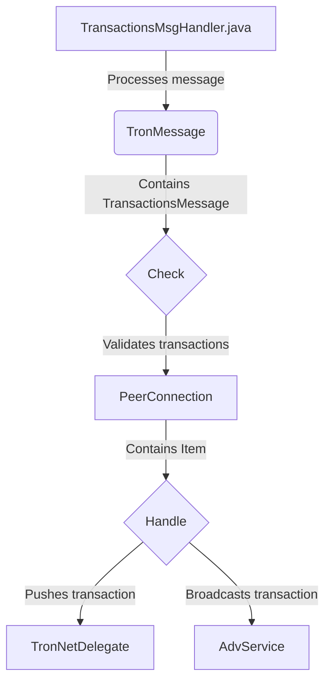

## Module: TransactionsMsgHandler.java
模块名称：TransactionsMsgHandler.java

主要目标：该模块的目的是处理交易消息。

关键功能：主要方法/功能及其作用包括：
1. init()：初始化处理智能合约。
2. close()：关闭处理器。
3. isBusy()：检查处理器是否繁忙。
4. processMessage()：处理来自对等节点的交易消息。
5. check()：检查交易消息的有效性。
6. handleSmartContract()：处理智能合约。
7. handleTransaction()：处理单个交易。

关键变量：重要变量包括MAX_TRX_SIZE、MAX_SMART_CONTRACT_SUBMIT_SIZE、smartContractQueue、queue、threadNum等。

相互依赖性：与其他系统组件的交互包括TronNetDelegate、AdvService等。

核心与辅助操作：主要操作包括处理智能合约和处理交易，辅助操作包括初始化和关闭处理器。

操作顺序：具有明显流程，包括处理智能合约、检查交易消息、处理交易等步骤。

性能方面：需要考虑线程池的性能，确保处理效率。

可重用性：具有适应性可重用性，可用于处理不同类型的交易消息。

用法：用于处理来自对等节点的交易消息，确保消息的有效性和及时处理。

假设：假设交易消息是有效的且处理器能够及时处理消息。
## Flow Diagram [via mermaid]

