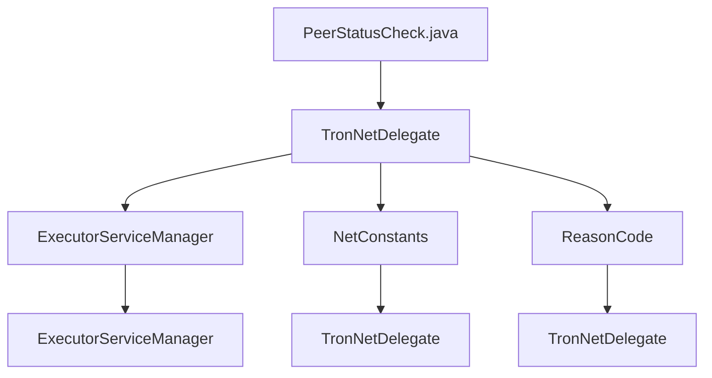

## Module: PeerStatusCheck.java
模块名称: PeerStatusCheck.java

主要目标: 此模块的目的是检查对等节点的状态并采取相应的操作。

关键功能: 
1. init() - 初始化方法，用于设置定时任务以检查对等节点状态。
2. close() - 关闭方法，用于终止对等节点状态检查的定时任务。
3. statusCheck() - 检查对等节点状态的方法，包括检查同步情况和超时情况等。

关键变量:
1. tronNetDelegate - 用于获取活动对等节点信息。
2. name - 用于标识对等节点状态检查任务的名称。
3. peerStatusCheckExecutor - 用于执行对等节点状态检查任务的定时执行器。
4. blockUpdateTimeout - 用于定义区块更新的超时时间。

相互依赖性: 
此模块依赖于TronNetDelegate类和ExecutorServiceManager类以获取对等节点信息和执行定时任务。

核心 vs. 辅助操作: 
核心操作是statusCheck()方法，用于检查对等节点状态。辅助操作包括init()和close()方法，用于初始化和关闭对等节点状态检查任务。

操作序列: 
1. 调用init()方法初始化对等节点状态检查任务。
2. 定时执行statusCheck()方法检查对等节点状态。
3. 调用close()方法关闭对等节点状态检查任务。

性能方面: 
定时任务的频率和超时时间是影响性能的关键因素，需要根据实际情况进行调整。

可重用性: 
此模块具有良好的可重用性，可以在其他系统中用于检查对等节点状态。

用法: 
PeerStatusCheck模块用于定期检查对等节点的状态，并根据情况采取相应的操作。

假设: 
1. 假设TronNetDelegate类和ExecutorServiceManager类已经正确配置和初始化。
2. 假设对等节点的状态检查需要定期进行，以确保网络正常运行。
## Flow Diagram [via mermaid]

