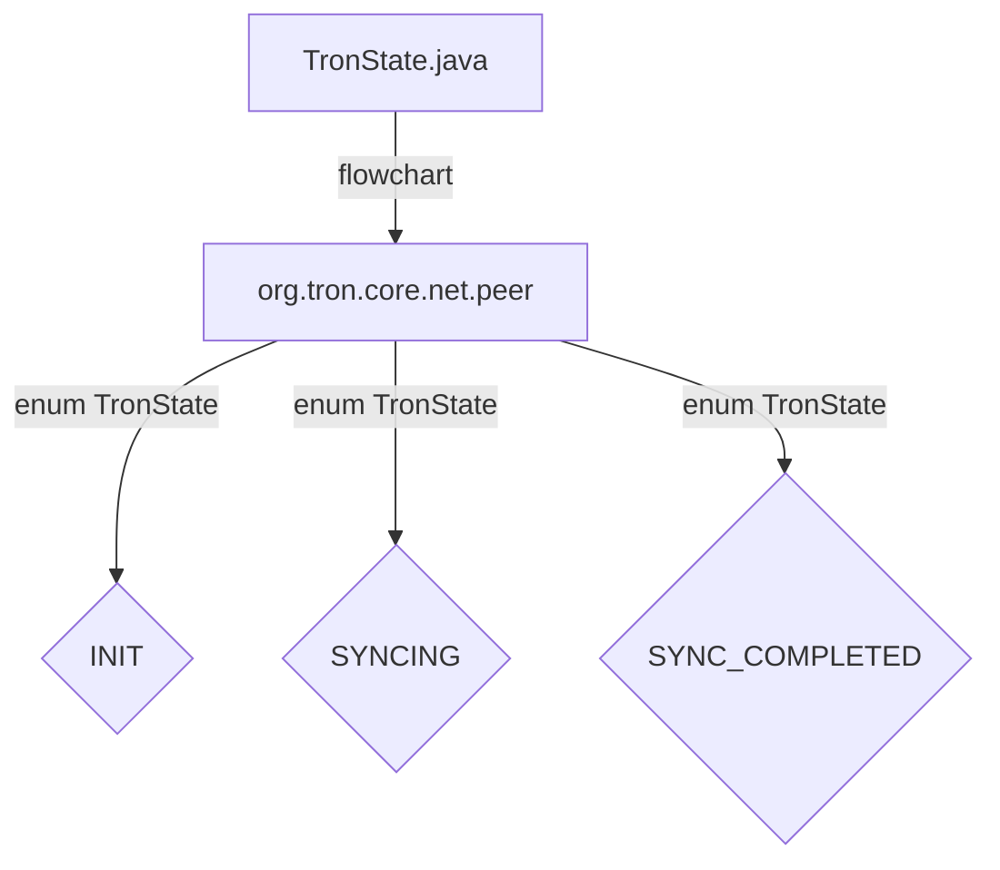

## Module: TronState.java
- **Module Name**: TronState.java
- **Primary Objectives**: The primary objective of this module is to define the different states that the Tron network nodes can be in.
- **Critical Functions**: 
    - INIT: Represents the initial state of a Tron node.
    - SYNCING: Indicates that the node is in the process of syncing with the rest of the network.
    - SYNC_COMPLETED: Signifies that the node has completed the syncing process.
- **Key Variables**: 
    - TronState: Enum variable that stores the different states of a Tron node.
- **Interdependencies**: This module interacts with other components of the Tron network to track the state of individual nodes.
- **Core vs. Auxiliary Operations**: The core operations of this module involve defining and tracking the different states of Tron nodes, while auxiliary operations may involve transitioning between states.
- **Operational Sequence**: The operational sequence involves nodes transitioning from INIT to SYNCING, and then from SYNCING to SYNC_COMPLETED.
- **Performance Aspects**: Performance considerations may include the efficiency of state transitions and the impact on overall network synchronization.
- **Reusability**: This module can be reused in other parts of the Tron network codebase to manage node states effectively.
- **Usage**: TronState.java is used to maintain and update the state of Tron nodes during network synchronization processes.
- **Assumptions**: Assumptions may include that the defined states cover all possible node states accurately and that the transitions between states are well-defined.
## Flow Diagram [via mermaid]

