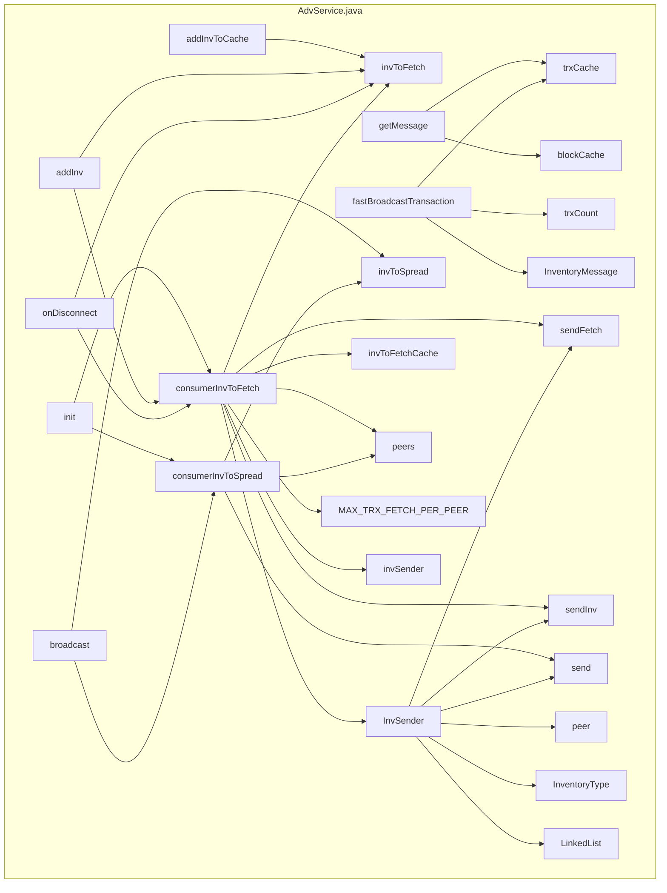

## Module: AdvService.java
模块名称：AdvService.java

主要目标：该模块的主要目标是管理和处理网络中的广告服务。

关键功能：主要方法/功能及其作用：
1. init()：初始化方法，启动扩散和获取线程。
2. close()：关闭方法，关闭扩散和获取线程。
3. addInvToCache(Item item)：将项目添加到缓存中。
4. addInv(Item item)：添加项目到广告服务中。
5. getMessage(Item item)：获取消息。
6. fastBroadcastTransaction(TransactionMessage msg)：快速广播交易。
7. broadcast(Message msg)：广播消息。
8. onDisconnect(PeerConnection peer)：处理断开连接事件。
9. consumerInvToFetch()：处理获取事件。
10. consumerInvToSpread()：处理扩散事件。

关键变量：重要变量包括invToFetchCache、trxCache、blockCache、invToFetch、invToSpread等。

相互依赖：与其他系统组件的交互主要是与TronNetDelegate和FetchBlockService等组件之间的交互。

核心与辅助操作：核心操作包括添加、广播、获取等操作，辅助操作包括初始化、关闭等操作。

操作顺序：初始化模块 -> 添加项目到缓存 -> 广播消息 -> 处理获取事件 -> 处理扩散事件 -> 关闭模块。

性能方面：该模块需要考虑缓存大小、超时时间等性能因素。

可重用性：该模块具有一定的可重用性，可以在其他网络服务中使用。

用法：该模块用于管理和处理网络中的广告服务，包括消息的广播、获取等操作。

假设：假设模块运行在Tron网络中，并且需要与其他网络组件进行交互。
## Flow Diagram [via mermaid]

