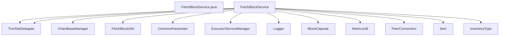

## Module: FetchBlockService.java
模块名：FetchBlockService.java

主要目标：该模块的主要目标是实现区块的获取和处理。

关键功能：主要方法/功能及其作用包括：
1. init()：初始化方法，用于启动区块获取处理的定时任务。
2. close()：关闭方法，用于终止区块获取处理的定时任务。
3. fetchBlock()：根据传入的区块哈希列表和对等节点，开始获取区块的过程。
4. blockFetchSuccess()：处理成功获取区块的情况。
5. fetchBlockProcess()：处理区块获取的具体流程。
6. shouldFetchBlock()：判断是否应该获取区块。
7. getPeerTop75()：获取对等节点的延迟信息。

关键变量：重要变量包括：
1. fetchBlockInfo：用于存储当前正在获取的区块信息。
2. fetchTimeOut：区块获取超时时间。
3. BLOCK_FETCH_LEFT_TIME_PERCENT：区块获取剩余时间比例。
4. esName：执行服务的名称。

相互依赖：与其他系统组件的交互包括：
1. TronNetDelegate：用于获取活跃的对等节点。
2. ChainBaseManager：用于获取链的基本信息。
3. BlockCapsule：用于处理区块信息。
4. PeerConnection：用于处理对等节点之间的连接。

核心与辅助操作：主要操作包括区块的获取和处理，辅助操作包括定时任务的管理。

操作序列：包括初始化、区块获取、区块处理等步骤。

性能方面：需要考虑定时任务的性能消耗和区块获取的效率。

重复使用性：该模块具有较高的重复使用性，可以在不同场景下灵活调用。

用法：通常用于区块链网络中的区块获取和处理过程。

假设：假设传入的区块哈希列表和对等节点信息是有效的。
## Flow Diagram [via mermaid]

