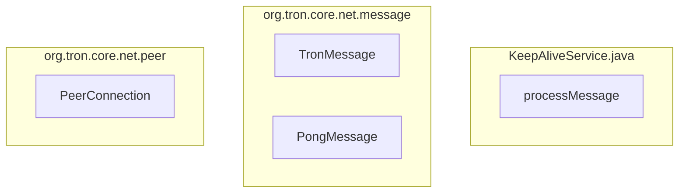

## Module: KeepAliveService.java
- **模块名称**: KeepAliveService.java
- **主要目标**: 该模块的目的是保持网络连接的活跃状态。
- **关键功能**: 
   - processMessage(PeerConnection peer, TronMessage message): 处理来自对等节点的消息，如果是P2P_PING类型的消息，则发送PongMessage消息作为响应。
- **关键变量**: 
   - peer: PeerConnection对象，表示与对等节点的连接。
   - message: TronMessage对象，表示接收到的消息。
- **相互依赖**: 与其他系统组件的交互主要是通过接收和发送消息来维持网络连接。
- **核心 vs. 辅助操作**: 核心操作是处理接收到的消息并发送响应消息，辅助操作可能包括其他网络连接维护功能。
- **操作序列**: 接收消息 -> 处理消息 -> 发送响应消息。
- **性能方面**: 考虑到网络连接的稳定性和响应速度。
- **可重用性**: 该模块可以根据需要在其他网络连接维护模块中重复使用。
- **用法**: 通常用于在对等节点之间保持网络连接的活跃状态。
- **假设**: 假设接收到的消息类型为P2P_PING，需要发送PongMessage作为响应。
## Flow Diagram [via mermaid]

