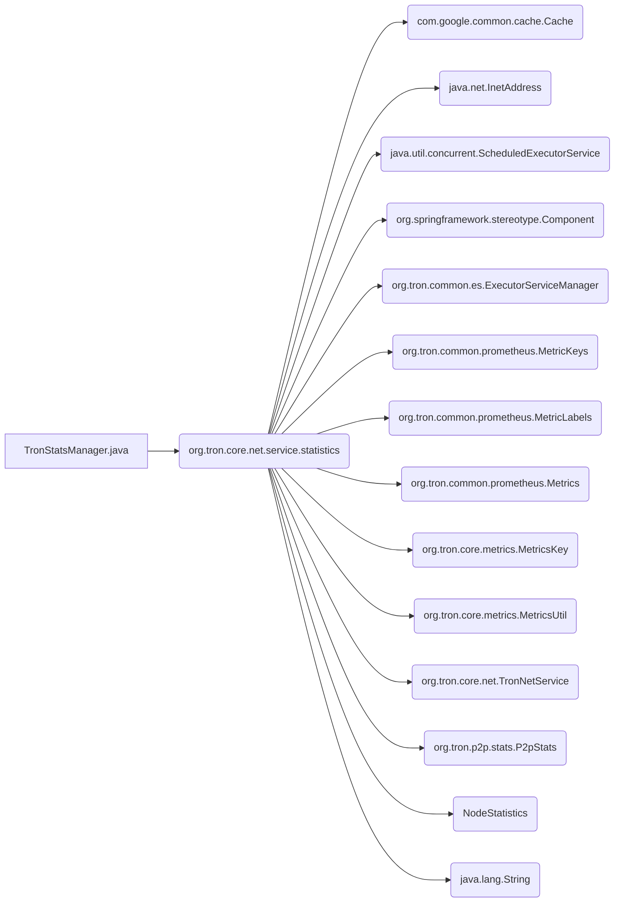

## Module: TronStatsManager.java
模块：TronStatsManager.java

主要目标：该模块的主要目标是管理和统计Tron网络服务的流量数据。

关键功能：主要方法/函数及其作用包括：
1. getNodeStatistics(InetAddress inetAddress)：获取特定InetAddress的节点统计信息。
2. init()：初始化方法，定期执行流量统计工作。
3. close()：关闭方法，用于终止流量统计工作。
4. work()：实际执行流量统计的方法，包括获取P2P服务的统计数据并更新相关指标。

关键变量：重要的变量包括TCP_TRAFFIC_IN、TCP_TRAFFIC_OUT、UDP_TRAFFIC_IN、UDP_TRAFFIC_OUT，以及Cache<InetAddress, NodeStatistics> cache等。

相互依赖性：该模块与TronNetService、P2pStats等系统组件有交互作用，通过这些组件获取网络流量数据并进行统计。

核心操作 vs. 辅助操作：核心操作包括流量统计和更新指标，而辅助操作包括初始化和关闭方法。

操作序列：模块的操作序列为初始化 -> 定期执行工作 -> 更新流量统计 -> 关闭。

性能方面：性能考虑主要集中在定期执行流量统计工作的效率和数据更新的实时性。

可重用性：该模块可以通过调整参数或扩展功能，适应不同的网络服务流量统计需求，具有一定的可重用性。

用法：TronStatsManager主要用于管理和统计Tron网络服务的流量数据，通过调用相关方法获取节点统计信息并更新流量指标。

假设：假设模块的正常运行需要正确配置和连接相关网络服务组件，并且在初始化时会执行必要的设置操作。
## Flow Diagram [via mermaid]

