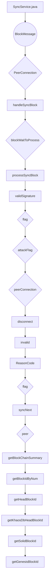

## Module: SyncService.java
模块名称：SyncService.java

主要目标：该模块的目的是实现同步服务。

关键功能：列出主要方法/函数及其作用。包括init（初始化）、close（关闭）、startSync（开始同步）、syncNext（同步下一个块）、processBlock（处理块）、onDisconnect（断开连接）、invalid（无效）、getBlockChainSummary（获取区块链摘要）、getBlockIdByNum（通过编号获取区块ID）、startFetchSyncBlock（开始获取同步块）、handleSyncBlock（处理同步块）、processSyncBlock（处理同步块）。

关键变量：指出关键变量。包括blockWaitToProcess、blockJustReceived、blockCacheTimeout、requestBlockIds、fetchEsName、handleEsName、fetchExecutor、blockHandleExecutor、handleFlag、fetchFlag、syncFetchBatchNum等。

相互依赖：注意与其他系统组件的交互。与TronNetDelegate、PbftDataSyncHandler等组件有相互依赖关系。

核心与辅助操作：区分主要操作和辅助操作。主要操作包括处理同步块、获取区块链摘要等；辅助操作包括初始化、关闭、开始同步等。

操作序列：描述任何特定流程。包括获取同步块、处理同步块、同步下一个块等操作序列。

性能方面：提及性能考虑。包括定时执行、缓存管理等方面的性能考虑。

重复使用性：讨论可重复使用性。该模块具有一定的可重复使用性，可适应不同的同步需求。

用途：讨论如何使用。用于实现节点之间的区块同步功能。

假设：列出任何假设。假设包括节点之间网络连接正常、区块数据正确等。
## Flow Diagram [via mermaid]

