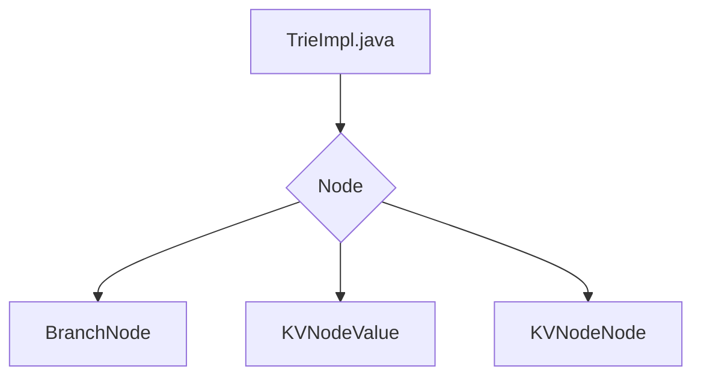

## Module: TrieImpl.java
模块名称：TrieImpl.java

主要目标：实现Trie数据结构的相关操作。

关键功能：包括get、put、delete、getRootHash等方法，用于获取、插入、删除数据以及获取根哈希等操作。

关键变量：cache、root、async、executor等变量用于缓存、根节点、异步标志、执行器等。

相互依赖：与ConcurrentHashDB、BytesCapsule、RLP等相关类有相互作用。

核心操作与辅助操作：主要操作为get、put、delete等方法，辅助操作包括encode、hasRoot等方法。

操作序列：首先进行初始化，然后根据需求调用get、put、delete等方法进行操作。

性能方面：通过异步编码和线程池实现性能优化。

可重用性：具有良好的可扩展性和重用性，可适应不同场景的需求。

用法：通过创建TrieImpl对象并调用相关方法实现对Trie数据结构的操作。

假设：假设根哈希为空时将其视为空Trie。
## Flow Diagram [via mermaid]

