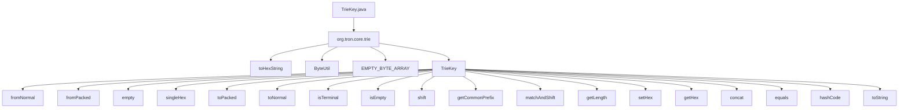

## Module: TrieKey.java
模块：TrieKey.java

主要目标：定义TrieKey类的目的是为了提供对字典树键的操作和处理。

关键功能：主要方法包括：
1. TrieKey(byte[] key, int off, boolean terminal)：构造方法，初始化TrieKey对象。
2. fromNormal(byte[] key)：从普通字节数组创建TrieKey对象。
3. fromPacked(byte[] key)：从打包字节数组创建TrieKey对象。
4. empty(boolean terminal)：创建一个空的TrieKey对象。
5. singleHex(int hex)：创建一个只包含一个十六进制数的TrieKey对象。
6. toPacked()：将TrieKey对象转换为打包形式的字节数组。
7. toNormal()：将TrieKey对象转换为普通形式的字节数组。
8. isTerminal()：判断TrieKey对象是否是终止键。
9. isEmpty()：判断TrieKey对象是否为空。
10. shift(int hexCnt)：移动指定数量的十六进制数。
11. getCommonPrefix(TrieKey k)：获取两个TrieKey对象的公共前缀。
12. matchAndShift(TrieKey k)：匹配并移动TrieKey对象。
13. concat(TrieKey k)：连接两个TrieKey对象。

关键变量：主要变量包括key（字节数组）、off（偏移量）、terminal（是否是终止键）。

相互依赖：TrieKey类与其他系统组件的交互主要体现在与字典树的操作和处理中。

核心与辅助操作：核心操作包括构造方法、转换方法、判断方法等；辅助操作包括移动、匹配、连接等。

操作序列：操作序列包括创建、转换、判断、移动、匹配、连接等一系列操作。

性能方面：在处理大量键值对时，需要考虑TrieKey对象的转换效率和匹配性能。

可重用性：TrieKey类具有良好的可重用性，可以在不同的字典树实现中被广泛应用。

用法：TrieKey类用于表示和操作字典树中的键，可以用于构建字典树数据结构。

假设：假设TrieKey对象的偏移量和终止标志在创建和操作过程中是正确设置的。
## Flow Diagram [via mermaid]

