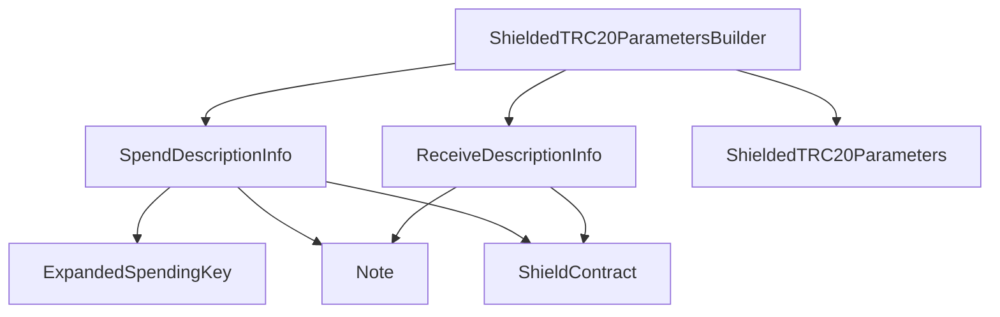

## Module: ShieldedTRC20ParametersBuilder.java
- **模块名称**: ShieldedTRC20ParametersBuilder.java
- **主要目标**: 该模块的目的是构建Shielded TRC20参数。
- **关键功能**: 
  - generateSpendProof: 生成消费证明。
  - generateOutputProof: 生成输出证明。
  - createSpendAuth: 创建消费授权。
  - build: 构建Shielded TRC20参数。
- **关键变量**: 
  - spends: 消费列表。
  - receives: 输出列表。
  - valueBalance: 余额。
- **相互依赖**: 与其他系统组件的交互包括生成消费证明、输出证明等。
- **核心 vs. 辅助操作**: 主要操作包括生成证明，创建授权等，辅助操作包括编码等。
- **操作顺序**: 先生成消费证明，然后生成输出证明，最后构建参数。
- **性能方面**: 需要考虑证明生成的性能。
- **可重用性**: 可以适应不同类型的Shielded TRC20参数构建。
- **用法**: 用于构建Shielded TRC20参数。
- **假设**: 假设输入数据有效且正确。
## Flow Diagram [via mermaid]

