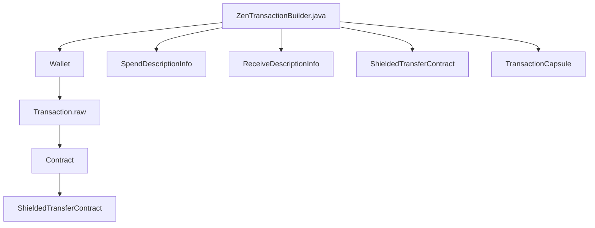

## Module: ZenTransactionBuilder.java
模块名称：ZenTransactionBuilder.java

主要目标：该模块的主要目标是构建和处理隐私交易的相关信息。

关键功能：主要方法/函数及其作用包括：
1. addSpend：添加支出信息并更新余额。
2. addOutput：添加输出信息并更新余额。
3. setTransparentInput：设置透明输入地址和金额。
4. setTransparentOutput：设置透明输出地址和金额。
5. buildWithoutAsk：构建交易信息（无需请求）。
6. build：构建交易信息。
7. createSpendAuth：创建支出授权签名。
8. generateSpendProof：生成支出证明。
9. generateOutputProof：生成输出证明。

关键变量：重要变量包括from、spends、receives、valueBalance、timeout等。

相互依赖性：与其他系统组件的交互主要包括与钱包、交易信息、加密模块等的交互。

核心与辅助操作：主要操作包括添加支出和输出信息，构建交易信息等为核心操作，设置透明输入输出为辅助操作。

操作顺序：操作顺序包括添加支出、添加输出、设置透明输入输出、构建交易信息等一系列操作。

性能方面：需要考虑的性能因素包括生成证明的效率和交易构建的速度。

可重用性：该模块具有一定的可重用性，可以适用于处理不同的隐私交易信息。

用法：该模块用于构建和处理隐私交易信息，包括添加支出、输出信息，生成证明等操作。

假设：假设该模块在构建和处理隐私交易信息时需要满足相关的加密和验证条件。
## Flow Diagram [via mermaid]

