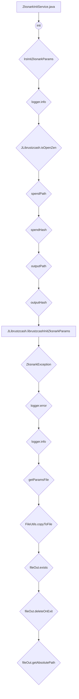

## Module: ZksnarkInitService.java
模块: ZksnarkInitService.java

主要目标: 该模块的目的是初始化Zksnark参数。

关键功能: 
1. librustzcashInitZksnarkParams(): 初始化Zksnark参数。
2. getParamsFile(String fileName): 获取参数文件。

关键变量: 
1. spendPath: 消费路径。
2. spendHash: 消费哈希值。
3. outputPath: 输出路径。
4. outputHash: 输出哈希值。

相互依赖: 与其他系统组件的交互关系是通过调用JLibrustzcash和LibrustzcashParam来实现的。

核心与辅助操作: 主要操作是初始化Zksnark参数，辅助操作是获取参数文件。

操作序列: 首先检查Zen开关状态，然后初始化Zksnark参数。

性能方面: 考虑到参数文件的复制和删除操作可能会影响性能。

可重用性: 该模块可以方便地用于其他需要Zksnark参数初始化的功能。

用法: 通过调用librustzcashInitZksnarkParams()方法来初始化Zksnark参数。

假设: 假设参数文件都能够正确获取和处理。
## Flow Diagram [via mermaid]

