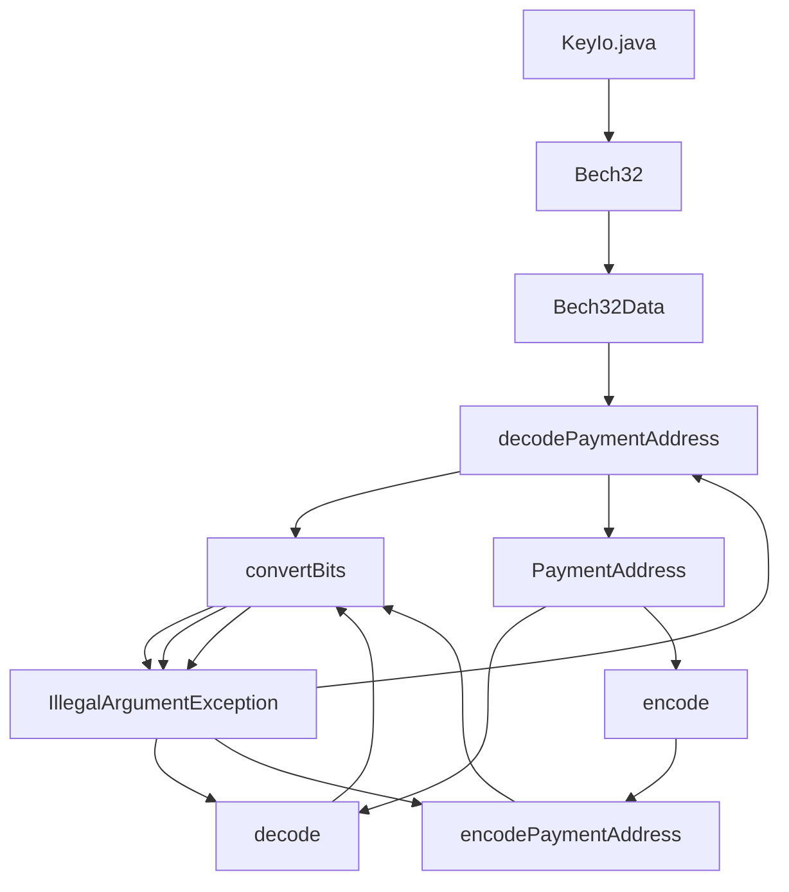

## Module: KeyIo.java
模块名称：KeyIo.java

主要目标：此模块的主要目标是处理支付地址的编码和解码操作。

关键功能：主要方法/函数及其角色：
1. decodePaymentAddress(String str)：解码支付地址字符串。
2. encodePaymentAddress(PaymentAddress zaddr)：编码支付地址对象。
3. convertBits()：帮助重新排列位到组的辅助方法。

关键变量：重要变量包括CONVERTED_SAPLING_PAYMENT_ADDRESS_SIZE和SAPLING_PAYMENT_ADDRESS。

相互依赖性：该模块与Bech32和PaymentAddress类相互作用。

核心 vs. 辅助操作：主要操作是解码和编码支付地址，辅助操作是位重新排列。

操作序列：解码支付地址 -> 位重新排列 -> 编码支付地址。

性能方面：性能方面考虑到了数据转换的效率和准确性。

可重用性：该模块具有较高的重用性，可以用于处理不同类型的支付地址。

用法：用于解码和编码特定格式的支付地址。

假设：假设输入字符串符合特定的编码格式和长度要求。
## Flow Diagram [via mermaid]

