## Module: SpendingKey.java
模块名称：SpendingKey.java

主要目标：该模块的主要目标是生成用于加密货币交易的支出密钥。

关键功能：主要方法/函数包括：
- random(): 生成随机的支出密钥。
- decode(String hex): 将十六进制字符串转换为支出密钥。
- expandedSpendingKey(): 生成扩展支出密钥。
- fullViewingKey(): 生成完整查看密钥。
- defaultAddress(): 获取默认支付地址。
- defaultDiversifier(): 获取默认分散器。

关键变量：重要变量包括value（支出密钥的值）、random（SecureRandom实例）等。

相互依赖性：该模块与其他系统组件的交互主要在生成扩展支出密钥、完整查看密钥和支付地址等方面。

核心与辅助操作：核心操作包括生成支出密钥、扩展支出密钥和完整查看密钥；辅助操作包括随机生成支出密钥和获取默认支付地址。

操作顺序：操作顺序包括生成支出密钥、生成扩展支出密钥、生成完整查看密钥、获取默认支付地址等。

性能方面：在性能方面，需要考虑随机数生成、加密算法的效率等因素。

可重用性：该模块具有较高的可重用性，可以用于不同加密货币交易系统中。

用法：该模块用于生成和处理支出密钥，生成支付地址等功能。

假设：假设模块中的加密算法和随机数生成函数能够正常运行，生成的密钥和地址有效。
## Flow Diagram [via mermaid]

```mermaid
graph TD
A(SpendingKey.java)
B[org.tron.core.zen.address]
C[java.security.SecureRandom]
D[java.util.Optional]
E[lombok.AllArgsConstructor]
F[lombok.Getter]
G[lombok.Setter]
H[org.tron.common.utils.ByteArray]
I[org.tron.common.zksnark.JLibrustzcash]
J[org.tron.common.zksnark.JLibsodium]
K[org.tron.common.zksnark.JLibsodiumParam.Blake2bFinalParams]
L[org.tron.common.zksnark.JLibsodiumParam.Blake2bInitSaltPersonalParams]
M[org.tron.common.zksnark.JLibsodiumParam.Blake2bUpdateParams]
N[org.tron.core.Constant]
O[org.tron.core.exception.BadItemException]
P[org.tron.core.exception.ZksnarkException]
Q[PaymentAddress]
R[DiversifierT]
S[PRF]
T[ExpandedSpendingKey]
U[FullViewingKey]

A --> B
A --> C
A --> D
A --> E
A --> F
A --> G
A --> H
A --> I
A --> J
A --> K
A --> L
A --> M
A --> N
A --> O
A --> P
A --> Q
A --> R
A --> S
A --> T
A --> U
```

