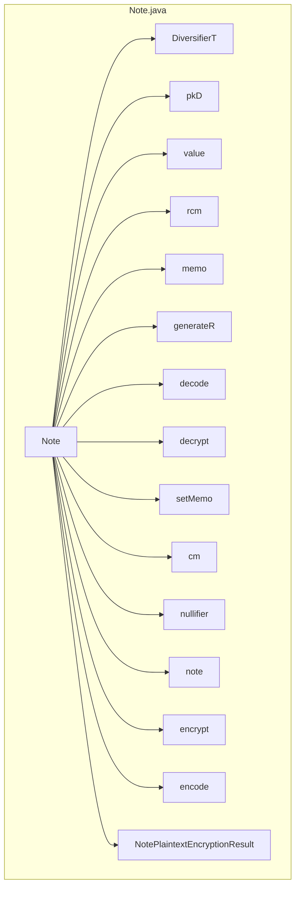

## Module: Note.java
模块：Note.java

主要目标：定义其目的是为了处理加密和解密笔记相关的功能。

关键功能：列出主要方法/函数及其作用是生成R、解码plain_enc到note、使用ivk解密c_enc到plain_enc、使用ovk解密c_enc到plain_enc、设置memo大小判断、计算承诺、计算无效、构建plain_enc等。

关键变量：重要变量包括d、pkD、value、rcm、memo。

相互依赖性：与其他系统组件的交互是通过调用JLibrustzcash库函数和其他辅助类来实现的。

核心与辅助操作：主要操作包括生成R、解码、解密、计算承诺、计算无效等核心功能，而设置memo大小判断、构建plain_enc等为辅助操作。

操作序列：具有特定的操作流程，涉及生成R、解码、解密、计算承诺、计算无效、构建plain_enc等步骤。

性能方面：需要考虑调用外部库函数的性能以及处理大量数据的性能。

可重用性：模块具有一定的可重用性，可以在其他项目中用于处理加密和解密笔记相关的功能。

用法：用于处理加密和解密笔记相关的功能，包括生成R、解码、解密、计算承诺、计算无效、构建plain_enc等操作。

假设：假设在使用过程中会按照规定的操作流程调用相应的方法，并且需要提供必要的参数以确保正确的功能实现。
## Flow Diagram [via mermaid]

