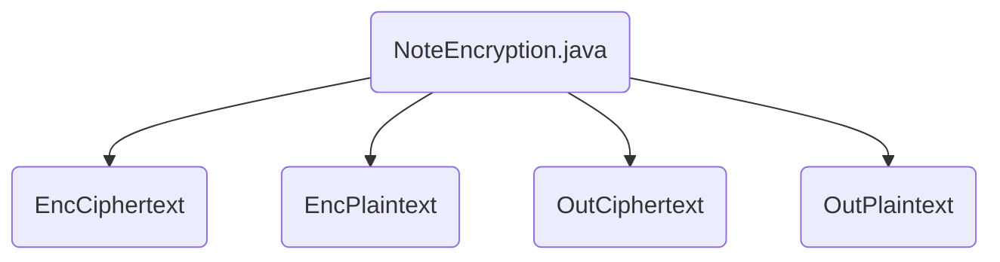

## Module: NoteEncryption.java
模块名称：NoteEncryption.java

主要目标：该模块的主要目的是实现加密和解密功能，用于保护数据的安全性。

关键功能：主要方法包括生成密钥对、加密消息、解密消息等功能。

关键变量：重要变量包括epk（临时公钥）、esk（临时私钥）、ciphertext（密文）、plaintext（明文）等。

相互依赖性：与其他系统组件的交互包括生成共享密钥、加密数据、解密数据等操作。

核心与辅助操作：主要操作包括生成密钥、加密消息、解密消息等核心功能，辅助操作包括生成随机数、计算哈希等。

操作顺序：操作顺序包括生成密钥对、加密消息、解密消息等具体流程。

性能方面：性能考虑包括加密解密速度、数据安全性等方面。

可重用性：该模块具有良好的可重用性，可以在不同场景下进行数据加密和解密操作。

用法：该模块用于加密和解密敏感数据，保护数据的安全性。

假设：假设包括生成密钥对成功、加密解密操作正常进行等。
## Flow Diagram [via mermaid]

