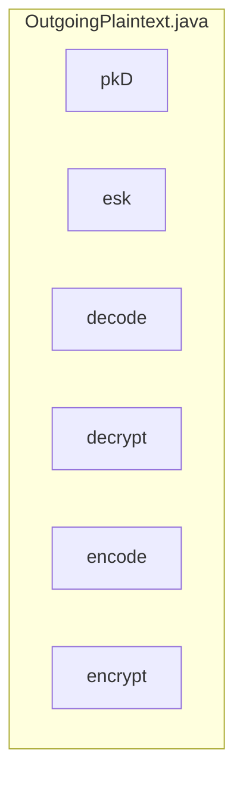

## Module: OutgoingPlaintext.java
模块名称：OutgoingPlaintext.java

主要目标：该模块的主要目标是实现对传出的明文进行加密和解密操作。

关键功能：主要方法/函数及其作用包括：
1. decode(OutPlaintext outPlaintext)：解码传入的OutPlaintext对象并返回OutgoingPlaintext对象。
2. decrypt(OutCiphertext ciphertext, byte[] ovk, byte[] cv, byte[] cm, byte[] epk)：对传入的OutCiphertext对象进行解密操作并返回Optional类型的OutgoingPlaintext对象。
3. encode()：将OutgoingPlaintext对象编码为OutPlaintext对象。

关键变量：重要变量包括pkD（公钥数据）、esk（临时私钥）等。

相互依赖性：该模块与其他系统组件的交互主要体现在加密和解密过程中，涉及NoteEncryption对象的调用。

核心与辅助操作：主要操作为加密和解密操作，辅助操作包括编码和解码过程。

操作序列：操作序列包括解码、解密、编码和加密过程。

性能方面：性能考虑主要集中在加密和解密操作的效率和准确性上。

可重用性：该模块具有一定的可重用性，可以在不同场景中用于对传出的明文进行加密和解密操作。

用法：该模块通常用于加密和解密传出的明文数据，通过调用相关方法实现加密和解密功能。

假设：该模块的假设包括传入的参数数据格式正确且符合要求，加密和解密操作的参数正确且完整。
## Flow Diagram [via mermaid]

