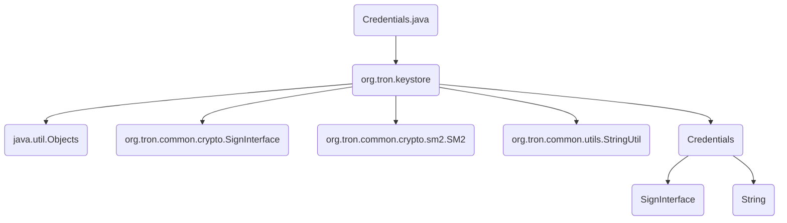

## Module: Credentials.java
模块名称：Credentials.java

主要目标：该模块旨在提供凭证包装功能。

关键功能：主要方法/功能及其作用包括：
- create(SignInterface cryptoEngine): 创建凭证对象并返回其地址。
- create(SM2 sm2Pair): 创建凭证对象并返回其地址。
- getSignInterface(): 获取签名接口。
- getAddress(): 获取地址。
- equals(Object o): 比较两个凭证对象是否相等。
- hashCode(): 计算凭证对象的哈希码。

关键变量：关键变量包括cryptoEngine（加密引擎）和address（地址）。

相互依赖：该模块与其他系统组件的交互包括使用加密引擎和地址进行凭证创建和比较。

核心与辅助操作：核心操作为创建凭证对象和获取地址，辅助操作为比较凭证对象和计算哈希码。

操作序列：操作序列包括创建凭证对象、获取地址、比较凭证对象和计算哈希码。

性能方面：性能考虑包括加密引擎的效率和地址编码的速度。

可重用性：该模块具有较高的可重用性，可用于创建不同加密引擎的凭证对象。

用途：该模块用于创建和管理凭证对象，包括获取地址和进行对象比较。

假设：假设包括凭证对象的创建需要有效的加密引擎和地址信息。
## Flow Diagram [via mermaid]

