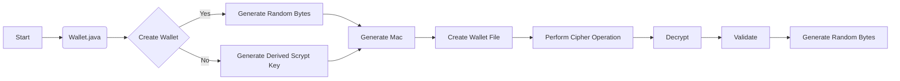

## Module: Wallet.java
- **模块名称**: 钱包（Wallet.java）
- **主要目标**: 定义其目的是管理以太坊钱包文件。
- **关键功能**: 
  - `create`: 创建钱包文件，生成加密私钥等信息。
  - `createStandard`: 创建标准钱包文件。
  - `createLight`: 创建轻量级钱包文件。
  - `decrypt`: 解密钱包文件，验证密码并返回私钥。
- **关键变量**: 
  - `AES_128_CTR`: AES加密算法。
  - `SCRYPT`: Scrypt加密算法。
  - `N_LIGHT`, `P_LIGHT`, `N_STANDARD`, `P_STANDARD`, `R`, `DKLEN`, `CURRENT_VERSION`: 一些常量。
- **相互依赖性**: 与其他系统组件的交互通过加密算法和参数传递实现。
- **核心与辅助操作**: 核心操作包括创建和解密钱包文件，辅助操作包括生成随机字节等。
- **操作序列**: 创建钱包文件的流程包括生成随机盐、派生加密密钥、执行加密操作等。
- **性能方面**: 使用了Scrypt和AES加密算法，需要考虑算法的性能。
- **可重用性**: 可以通过调整参数来适应不同的加密需求，具有一定的重用性。
- **用法**: 可以用于创建和解密以太坊钱包文件。
- **假设**: 假设了密码的正确性和钱包文件的格式符合当前版本。
## Flow Diagram [via mermaid]

