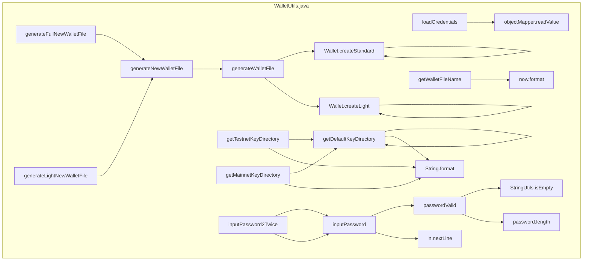

## Module: WalletUtils.java
模块：WalletUtils.java

主要目标：该模块的主要目标是提供与钱包文件相关的实用功能。

关键功能：主要方法/函数及其作用：
1. generateFullNewWalletFile(String password, File destinationDirectory)：生成包含完整信息的新钱包文件。
2. generateLightNewWalletFile(String password, File destinationDirectory)：生成包含轻量级信息的新钱包文件。
3. generateNewWalletFile(String password, File destinationDirectory, boolean useFullScrypt)：生成新的钱包文件。
4. generateWalletFile(String password, SignInterface ecKeyPair, File destinationDirectory, boolean useFullScrypt)：生成钱包文件。
5. loadCredentials(String password, File source)：加载凭证信息。
6. getDefaultKeyDirectory()：获取默认密钥目录。
7. getTestnetKeyDirectory()：获取测试网络密钥目录。
8. getMainnetKeyDirectory()：获取主网络密钥目录。
9. passwordValid(String password)：验证密码有效性。
10. inputPassword()：输入密码。
11. inputPassword2Twice()：输入密码两次。

关键变量：重要变量包括password、destinationDirectory、ecKeyPair、walletFile等。

相互依赖：与其他系统组件的交互包括使用SignUtils、Args、Wallet等类的方法和功能。

核心操作 vs. 辅助操作：主要操作包括生成新钱包文件、加载凭证信息等，辅助操作包括验证密码有效性、获取密钥目录等。

操作顺序：操作流程包括生成新钱包文件、加载凭证信息、验证密码有效性等。

性能方面：性能考虑包括密码验证的效率、密钥文件生成的速度等。

可重用性：该模块具有高度的可重用性，可以在不同项目中轻松地调用和应用。

用法：该模块用于处理钱包文件的创建、加载和验证等功能，可用于加密货币钱包应用程序的开发。

假设：该模块假设用户提供的密码符合一定的规则，且密钥文件生成过程中不会出现意外情况。
## Flow Diagram [via mermaid]

