## Module: SolidityNode.java
模块名称：SolidityNode.java

主要目标：该模块的目的是启动Solidity节点并处理区块链数据。

关键功能：主要方法包括start()、getBlock()、processBlock()、loopProcessBlock()、getBlockByNum()、getLastSolidityBlockNum()、sleep()和resolveCompatibilityIssueIfUsingFullNodeDatabase()等。这些方法负责启动Solidity节点、获取区块数据、处理区块、循环处理区块、根据区块号获取区块、获取最新Solidity区块号、线程休眠和解决使用完整节点数据库的兼容性问题。

关键变量：重要变量包括dbManager、chainBaseManager、databaseGrpcClient、ID、remoteBlockNum、blockQueue、exceptionSleepTime和flag等。

相互依赖：该模块与数据库、区块链管理器、远程区块号等组件进行交互。

核心与辅助操作：主要操作包括启动Solidity节点、处理区块数据等核心操作，辅助操作包括线程休眠、解决兼容性问题等。

操作序列：首先启动Solidity节点，然后获取区块数据并处理，最后循环处理区块数据。

性能方面：需要考虑处理区块数据的性能和效率。

可重用性：该模块具有一定的可重用性，可以适应不同的Solidity节点启动和区块处理需求。

用法：该模块用于启动Solidity节点并处理区块数据。

假设：假设使用了链基本管理器、数据库客户端和其他必要组件来启动Solidity节点并处理区块数据。
## Flow Diagram [via mermaid]

```mermaid
graph TD
  A(SolidityNode.java) -->|Creates| B(Manager)
  A -->|Uses| C(ChainBaseManager)
  A -->|Uses| D(DatabaseGrpcClient)
  A -->|Creates| E(AtomicLong)
  A -->|Creates| F(LinkedBlockingDeque)
  A -->|Assigns| G(int)
  A -->|Assigns| H(boolean)
  A -->|Creates| I(Block)
  A -->|Creates| J(Args)
  A -->|Creates| K(CommonParameter)
  A -->|Creates| L(TronApplicationContext)
  A -->|Creates| M(Application)
  A -->|Creates| N(RpcApiService)
  A -->|Creates| O(SolidityNodeHttpApiService)
  A -->|Creates| P(Thread)
  A -->|Creates| Q(BlockCapsule)
  A -->|Creates| R(Block)
  A -->|Creates| S(DefaultConfig)
  A -->|Creates| T(LinkedBlockingDeque)
  A -->|Creates| U(Manager)
  A -->|Creates| V(ChainBaseManager)
  A -->|Creates| W(DatabaseGrpcClient)
  A -->|Creates| X(AtomicLong)
  A -->|Creates| Y(AtomicLong)
  A -->|Creates| Z(LinkedBlockingDeque)
  A -->|Assigns| AA(int)
  A -->|Assigns| AB(boolean)
```

