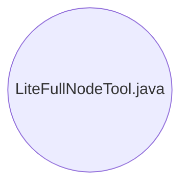

## Module: LiteFullNodeTool.java
模块：LiteFullNodeTool.java

主要目标：LiteFullNodeTool模块的主要目标是生成快照数据集和历史数据集，以及将历史数据集合并到数据库中。

关键功能：
1. generateSnapshot(String sourceDir, String snapshotDir)：创建快照数据集。
2. generateHistory(String sourceDir, String historyDir)：创建历史数据集。
3. completeHistoryData(String historyDir, String databaseDir)：将历史数据集合并到数据库中。

关键变量：RECENT_BLKS，SNAPSHOT_DIR_NAME，HISTORY_DIR_NAME，INFO_FILE_NAME等为关键变量。

相互依赖性：LiteFullNodeTool模块与其他系统组件的交互主要通过数据库操作和文件操作实现。

核心操作与辅助操作：生成快照数据集和历史数据集是核心操作，其他操作如数据备份、数据复制等为辅助操作。

操作顺序：首先创建快照数据集，然后创建历史数据集，最后将历史数据集合并到数据库中。

性能方面：LiteFullNodeTool模块需要考虑数据处理的效率和速度，尤其是在大数据量情况下的性能表现。

可重用性：LiteFullNodeTool模块具有一定的可重用性，可以根据需要对其进行适当的修改和扩展以满足不同场景的需求。

用法：LiteFullNodeTool模块可用于生成和处理快照数据集和历史数据集，以及将历史数据集合并到数据库中。

假设：LiteFullNodeTool模块假设输入的数据格式和数据库结构符合预期的要求，且操作过程中不会出现严重错误或异常情况。
## Flow Diagram [via mermaid]

