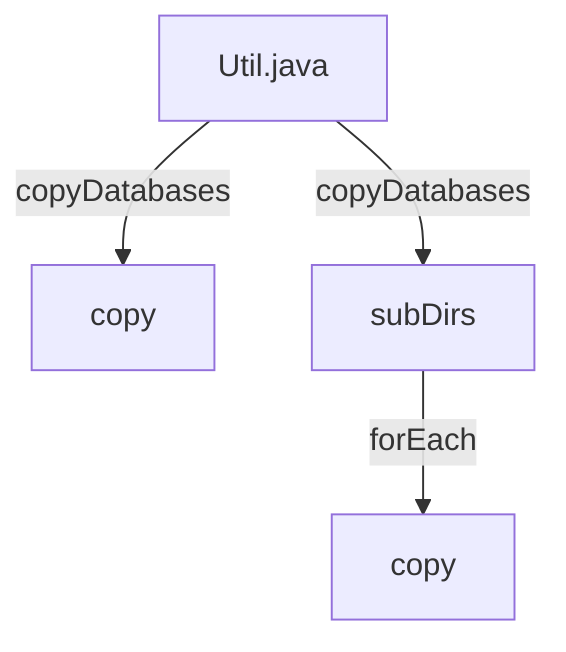

## Module: Util.java
模块名称：Util.java

主要目标：该模块的主要目标是提供文件复制和处理数据库的功能。

关键功能：主要方法/功能包括：
1. copyDatabases：复制数据库文件到指定目录，只复制指定的子目录。
2. copy：复制文件或创建硬链接。

关键变量：重要变量包括src（源路径或文件）、dest（目标路径或文件）、subDirs（要复制的子目录列表）。

相互依赖：该模块依赖于FileUtil类中的方法，用于检查文件是否存在。

核心与辅助操作：主要操作是复制文件和创建硬链接，辅助操作包括遍历目录和处理异常情况。

操作序列：操作序列包括创建子目录、遍历源文件、复制文件或创建硬链接。

性能方面：考虑到使用了parallel()方法并行处理文件复制，性能可能受到影响。

可重用性：该模块提供了文件复制和处理数据库的功能，可以在其他项目中重复使用。

用法：该模块通常用于LiteFullNodeTool工具中，用于复制数据库文件。

假设：假设源文件和目标文件都存在且可访问，以及子目录列表有效。
## Flow Diagram [via mermaid]

