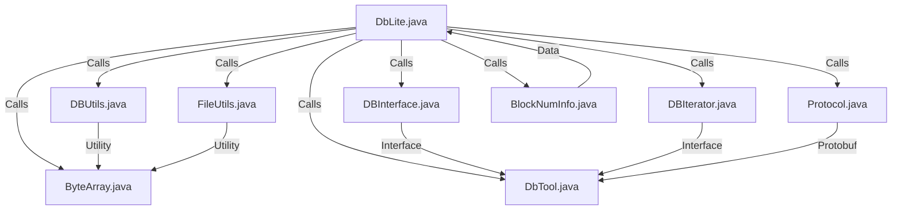

## Module: DbLite.java
模块：DbLite.java
主要目标：拆分和合并Java-Tron的轻量数据。
关键功能：生成快照数据集、生成历史数据集、将历史数据集合并到数据库中。
关键变量：operate、type、fnDataPath、datasetPath等。
相互依赖：与RocksDB、Protocol等组件进行交互。
核心vs.辅助操作：生成快照和历史数据集为核心操作，备份、复制等为辅助操作。
操作序列：根据操作类型执行相应的数据处理操作。
性能方面：考虑数据处理效率和存储空间利用。
可重用性：具有灵活性和可适应性，可用于其他数据处理任务。
用法：通过命令行参数指定操作类型和数据路径进行数据处理。
假设：假设数据源是Java-Tron的完整节点数据。
## Flow Diagram [via mermaid]

